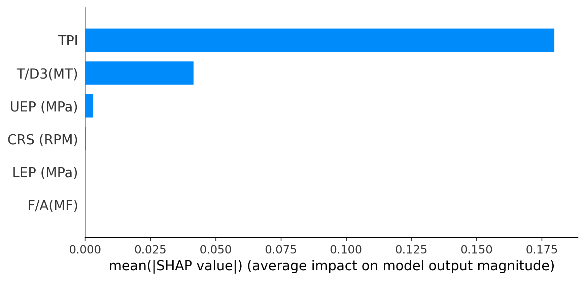
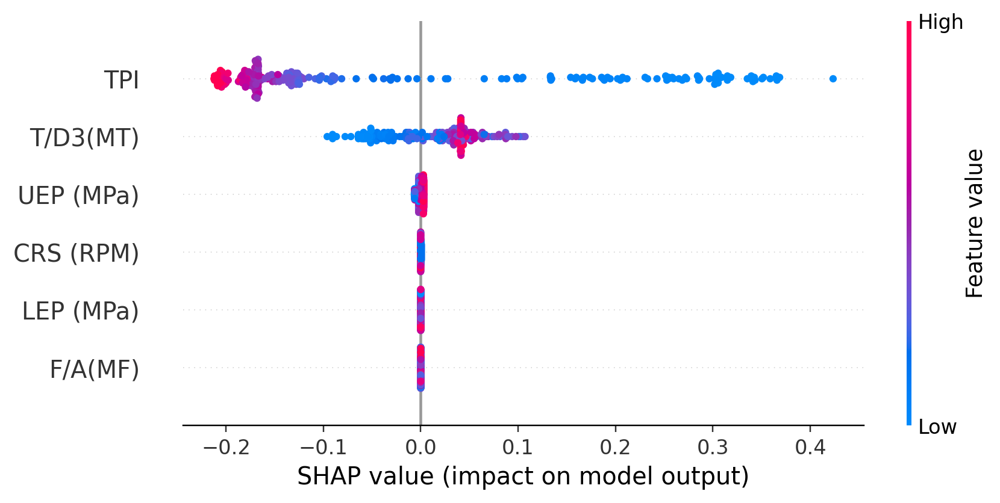
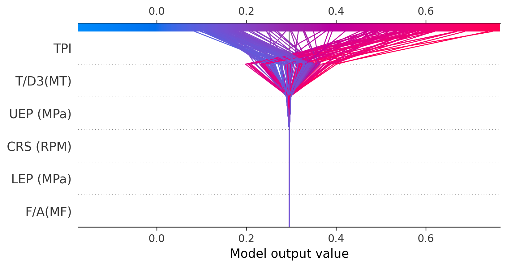
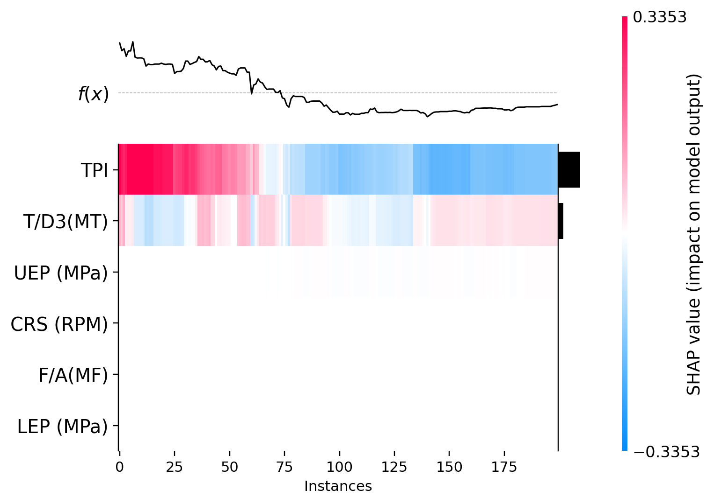
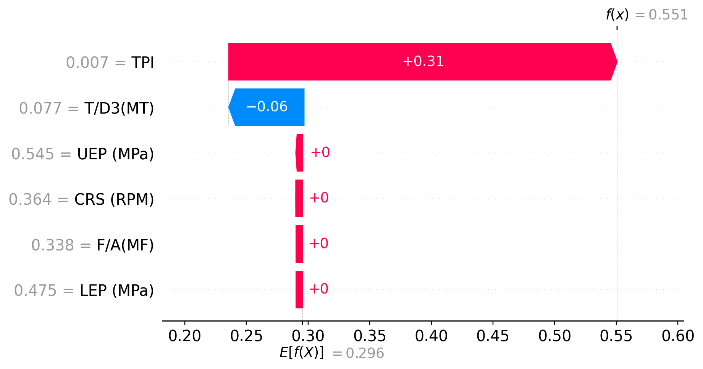

# AI9 — SHAP Explainability for Gradient Boosting (80/20 split)

## Abstract
This document presents an explainability analysis of a GradientBoostingRegressor trained on an 80/20 split to predict the tunnel boring machine penetration rate PR (mm/r) from operational and derived features. Explanations are produced with SHAP (TreeExplainer) on the TEST set. Results show a dominant role of **TPI** (Torque Penetration Index) in the model’s predictions, followed by **T/D3(MT)** (normalized torque). The features **UEP**, **CRS**, **F/A** and **LEP** have mean contributions close to zero in this model. A directionality analysis (20% vs 80% quantiles) indicates that high values of **TPI** tend to decrease predicted PR, while high values of **T/D3(MT)** tend to increase it.

## 1. Context and objective
Gradient boosting trees provide strong predictive performance but are hard to interpret for non-specialists. The goal is to deliver a reproducible, scientific interpretation of feature impacts on model outputs:

$$\hat{y}(x) = f(x)$$

where $\hat{y}$ is the model output (in normalized scale; see Methods) and $x$ the input feature vector.

## 2. Data and features
### 2.1 Target
- **PR (mm/r)**: penetration rate (millimeters per revolution).

### 2.2 Explanatory features
- **CRS (RPM)**: cutterhead rotation speed.
- **F/A(MF)**: mean thrust.
- **T/D3(MT)**: mean torque normalized by $D^3$.
- **UEP (MPa)** / **LEP (MPa)**: upper/lower earth pressure.
- **TPI (Torque Penetration Index)**: index derived from torque and penetration.

Physical expectations: high TPI typically indicates higher effort per unit advance and correlates with lower PR. UEP/LEP are safety/stability indicators and can have limited direct impact on PR.

**Important methodological note:** TPI is often defined using penetration metrics; if TPI encodes information derived from PR, its SHAP importance may reflect partial target leakage. See Discussion.

## 3. Methods
### 3.1 Split and normalization
Inputs come from the AI8 pipeline:

- TRAIN: `Internship_Research/AI8/split_train_norm_80_20.csv`
- TEST: `Internship_Research/AI8/split_test_norm_80_20.csv`

Features and the target are MinMax-normalized using TRAIN fit. All SHAP values and model outputs reported here are expressed in this normalized space.

### 3.2 Model
GradientBoostingRegressor with:
- `n_estimators=200`
- `learning_rate=0.01`
- `max_depth=3`
- `subsample=1.0`
- `min_samples_leaf=2`
- `random_state=42`

### 3.3 SHAP
SHAP values computed with `shap.TreeExplainer`. The additive decomposition is:

$$f(x) = \phi_0 + \sum_{j=1}^p \phi_j$$

- $\phi_0$: baseline value
- $\phi_j$: contribution of feature $j$ (positive increases prediction, negative decreases)

### 3.4 Figures produced
All figures are produced on TEST:
- Fig.1: `images/shap_summary_bar_test.png` (global mean(|SHAP|)).
- Fig.2: `images/shap_summary_beeswarm_test.png` (distribution + direction).
- Fig.3: `images/shap_decision_test.png` (decision trajectories, up to 200 observations).
- Fig.4: `images/shap_heatmap_test.png` (heatmap, up to 200 observations).
- Fig.5: `images/shap_waterfall_median_abs_error_test.png` (local waterfall for the median-absolute-error sample).

### 3.5 Tabular outputs
- `shap_importance_mean_abs_test.csv` (global mean absolute SHAP)
- `shap_directionality_test.csv` (mean SHAP at low vs high quantiles)
- `shap_local_explanation_median_abs_error_test.csv` (detailed local breakdown)

## 4. Results
### 4.1 Global importance (Figure 1)
Mean absolute SHAP on TEST:

- TPI : 0.179827
- T/D3(MT) : 0.041554
- UEP (MPa) : 0.002870
- CRS (RPM) : 0.000146
- F/A(MF) : 0.000000
- LEP (MPa) : 0.000000

Quantitative conclusion: the average absolute contribution of TPI is ~4.3× that of T/D3(MT) and orders of magnitude above CRS. Model variability is therefore dominated by TPI.

### 4.2 Directionality (Figure 2 and quantile analysis)
The beeswarm encodes feature value (color) and SHAP magnitude/direction (horizontal). For numeric confirmation, `shap_directionality_test.csv` reports mean SHAP in low (<=20%) vs high (>=80%) quantiles; the difference (high - low) is:

- TPI : Δ = -0.493627 (high quantile strongly reduces prediction)
- T/D3(MT) : Δ = +0.092208 (high quantile increases prediction)
- UEP (MPa) : Δ = +0.007920 (small positive effect)
- CRS (RPM) : Δ = -0.000314 (negligible)
- F/A(MF) : Δ = 0.000000 (no effect)
- LEP (MPa) : Δ = 0.000000 (no effect)

Interpretation: TPI has a strong negative directional effect at high values; T/D3(MT) shows a moderate positive effect.

### 4.3 Local decomposition (Figure 5)
For the representative sample (median absolute error) the local CSV shows:

- sample index: 128
- baseline φ0 : 0.295543
- f(x) prediction : 0.550632
- y_true : 0.596771
- residual (y_true - f(x)) : 0.046139

Principal contributions:
- TPI (value 0.006836 normalized) : φ_TPI = +0.314838
- T/D3(MT) (0.077279) : φ_T/D3 = -0.060872
- UEP (0.545455) : φ_UEP = +0.001055
- CRS (0.363636) : φ_CRS = +0.000068
- F/A and LEP : φ ≈ 0

Summation check: φ0 + Σ φ_j ≈ f(x).

## 5. Figure-by-figure interpretation (detailed)
### 5.1 Figure 1 — summary bar (global importance)
Figure 1 ranks features by E(|φ_j|). A feature can be large even if it both increases and decreases predictions across samples. The dominance of TPI indicates the tree ensemble places most splitting power on that feature.

**Detailed note:** TPI (0.179827) indicates that, on average, a unit movement in normalized TPI yields the largest absolute change in model output compared to other features.

### 5.2 Figure 2 — beeswarm (distribution + sign)
Beeswarm shows per-sample φ_j (x-axis) colored by raw feature value. Quantile analysis quantifies direction.

**Detailed note (by feature):**
- TPI: strong negative shift for high values (Δ ≈ -0.4936 between 80% and 20% quantiles).
- T/D3(MT): moderate positive shift for high values (Δ ≈ +0.0922).
- UEP: very small positive tendency (Δ ≈ +0.0079).
- CRS/F/A/LEP: negligible.

### 5.3 Figure 3 — decision plot (trajectories)
Decision plot visualizes cumulative contributions per observation up to f(x).

**Detailed note:** the largest divergence among trajectories occurs at the application of TPI, confirming its role as a primary partitioning variable in the ensemble.

### 5.4 Figure 4 — heatmap (patterns)
Heatmap visualizes φ_{i,j} matrix; strong red/blue bands indicate subpopulations.

**Detailed note:** TPI exhibits broad red/blue bands (large, structured contributions across subsets); other features show near-zero bands.

### 5.5 Figure 5 — waterfall (local attribution)
Waterfall provides the additive decomposition for a single representative sample.

**Detailed note:** the representative case is dominated by a large positive TPI contribution (+0.31484) partially offset by T/D3(MT) (-0.06087).

## 6. Discussion and limitations
### 6.1 TPI dominance and potential leakage
Because TPI is computed from torque and penetration metrics, check whether its definition includes or is strongly correlated with PR; otherwise importance may partly reflect an encoded target signal.

Recommended checks:
- Retrain model without TPI and re-evaluate SHAP to assess stability.
- Inspect TPI formula in source data to detect any direct dependence on PR.

### 6.2 Causality and operational interpretation
Observed SHAP associations are associative (model-learned). High T/D3(MT) increasing predicted PR may reflect operator adjustments or confounding variables rather than direct causal effect; treat operational recommendations accordingly.

### 6.3 Normalization
All reported values are in MinMax-normalized space. To interpret effects in physical units (mm/r) invert the target scaler and optionally recompute explanations on the de-normalized output.

## 7. Reproducibility
Script: `Internship_Research/AI9_SHAP_GB_80_20/shap_gradient_boosting_80_20.py`

Outputs:
- `Internship_Research/AI9_SHAP_GB_80_20/images/*.png`
- `Internship_Research/AI9_SHAP_GB_80_20/shap_importance_mean_abs_test.csv`
- `Internship_Research/AI9_SHAP_GB_80_20/shap_directionality_test.csv`
- `Internship_Research/AI9_SHAP_GB_80_20/shap_local_explanation_median_abs_error_test.csv`

---

If you want, I can also produce a publication-ready English paragraph (150–250 words) summarizing these findings for a manuscript or an executive slide. 