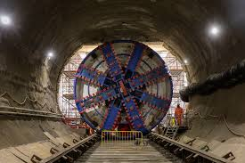
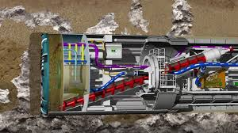
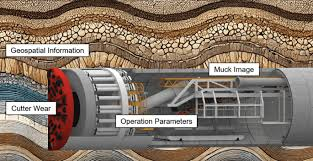

# Introduction

Mechanized excavation using Tunnel Boring Machines (TBMs) is a standard solution for underground infrastructure projects (transportation, water, utilities). During operation, the cutterhead interacts continuously with variable geological conditions, which makes precise control of the operating parameters essential.

In this context, the penetration rate (PR, mm/rev) is a key indicator: it measures advancement per cutterhead revolution and reflects productivity, tool wear, energy consumption and, indirectly, project cost and schedule. Improving PR prediction helps refine machine settings and identify unfavorable ground conditions earlier.

Figure 1. Photograph of the TBM working inside the tunnel.

Figure 2. TBM schematic showing operating parameters and interaction with the ground mass.

This study is positioned at the interface of applied geomechanics and machine learning. The available signals — rotation speed, thrust, torque, face pressures, and derived indices such as specific energy, FPI, TPI, etc. — characterize both machine behavior and ground response. Machine learning methods, especially tree-based and boosting models (Random Forest, Gradient Boosting, XGBoost) and kernel-based approaches (SVR, RVM), are used to analyze these signals and capture nonlinear relationships and complex interactions that are difficult to describe with simple empirical rules (Khatti & Mishra, 2025; Yagiz, 2008; Breiman, 2001; Friedman, 2001). The datasets used in this work come from the open-access study by Khatti and Mishra (2025), which focuses on TBM penetration rate estimation in mixed-face conditions and examines feature selection and multicollinearity effects on machine and deep learning models.

Figure 3. TBM schematic illustrating the excavation zone, muck removal and geological context.

The main objective of this paper is to evaluate how well machine learning models can predict TBM penetration rate from operational and derived variables, and to identify the most influential predictors. Beyond prediction accuracy, the study also examines the consistency of the results across different model families and highlights the role of derived indices in the interpretation of TBM performance. The remainder of the paper is organized as follows: Section 2 presents the data preparation and methodology, Section 3 reports the results and discussion, and Section 4 concludes the paper.

Selected references mentioned in this introduction:
- Khatti, J., & Mishra, S. (2025). Estimating shield tunnel boring machine penetration rate in mixed face conditions: feature selection and multicollinearity effects on machine and deep learning models. Frontiers in Built Environment, 11, 1699466.
- Yagiz, S. (2008). Utilizing rock mass properties for predicting TBM performance in hard rock tunneling. Tunnelling and Underground Space Technology, 23(3), 326–337.
- Breiman, L. (2001). Random forests. Machine Learning, 45(1), 5–32.
- Friedman, J. H. (2001). Greedy function approximation: a gradient boosting machine. The Annals of Statistics, 29(5), 1189–1232.
- Lundberg, S. M., & Lee, S.-I. (2017). A unified approach to interpreting model predictions. Advances in Neural Information Processing Systems.