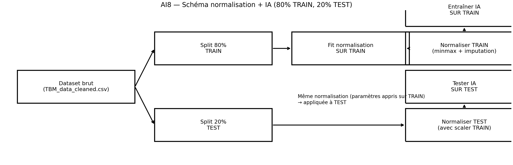

# Introduction

Mechanized excavation using Tunnel Boring Machines (TBMs) is a standard solution for underground infrastructure projects (transportation, water, utilities). During operation, the cutterhead interacts continuously with variable geological conditions, which makes precise control of the operating parameters essential.

In this context, the penetration rate (PR, mm/rev) is a key indicator: it measures advancement per cutterhead revolution and reflects productivity, tool wear, energy consumption and, indirectly, project cost and schedule. Improving PR prediction helps refine machine settings and identify unfavorable ground conditions earlier.

Figure 1. Photograph of the TBM working inside the tunnel.

Figure 2. TBM schematic showing operating parameters and interaction with the ground mass.

Figure 3. TBM schematic illustrating the excavation zone, muck removal and geological context.

This study is positioned at the interface of applied geomechanics and machine learning. The available signals — rotation speed, thrust, torque, face pressures, and derived indices such as specific energy, FPI, TPI, etc. — characterize both machine behavior and ground response. Machine learning methods, especially tree-based and boosting models (Random Forest, Gradient Boosting, XGBoost) and kernel-based approaches (SVR, RVM), are used to analyze these signals and capture nonlinear relationships and complex interactions that are difficult to describe with simple empirical rules (Khatti & Mishra, 2025; Yagiz, 2008; Breiman, 2001; Friedman, 2001). The datasets used in this work come from the open-access study by Khatti and Mishra (2025), which focuses on TBM penetration rate estimation in mixed-face conditions and examines feature selection and multicollinearity effects on machine and deep learning models.

This paper contributes in three practical ways: (1) it proposes a compact, reproducible modeling pipeline that links preprocessing, model selection and local explainability; (2) it assesses the relative importance of raw operating signals versus derived indices for PR prediction; and (3) it documents pitfalls related to circularity when using indices that are conceptually close to the target. The methodology emphasizes reproducibility: all splits, fitted preprocessors and trained models are archived so that the experiments can be replayed and independently inspected.

The main objective of this paper is to evaluate how well machine learning models can predict TBM penetration rate from operational and derived variables, and to identify the most influential predictors. Beyond prediction accuracy, the study also examines the consistency of the results across different model families and highlights the role of derived indices in the interpretation of TBM performance. The remainder of the paper is organized as follows: Section 2 presents the data preparation and methodology, Section 3 reports the results and discussion, and Section 4 concludes the paper.

Selected references mentioned in this introduction:
- Khatti, J., & Mishra, S. (2025). Estimating shield tunnel boring machine penetration rate in mixed face conditions: feature selection and multicollinearity effects on machine and deep learning models. Frontiers in Built Environment, 11, 1699466.
- Yagiz, S. (2008). Utilizing rock mass properties for predicting TBM performance in hard rock tunneling. Tunnelling and Underground Space Technology, 23(3), 326–337.
- Breiman, L. (2001). Random forests. Machine Learning, 45(1), 5–32.
- Friedman, J. H. (2001). Greedy function approximation: a gradient boosting machine. The Annals of Statistics, 29(5), 1189–1232.
- Lundberg, S. M., & Lee, S.-I. (2017). A unified approach to interpreting model predictions. Advances in Neural Information Processing Systems.

## 2 Methodology

### 2.1 Data source and study variables
The analysis starts from the cleaned TBM dataset assembled in the repository and reduced to a modeling subset containing six explanatory variables and one target variable. The target is the penetration rate PR (mm/rev). The final feature set used in the fixed 80/20 pipeline is: CRS (RPM), F/A(MF), T/D3(MT), UEP (MPa), LEP (MPa), and TPI. These variables summarize the main operating conditions of the cutterhead, the pressure balance at the face, and the excavation effort.

The workflow keeps the target definition consistent across preprocessing, model training and explainability so that predictive performance and SHAP attributions are computed in the same modeling space.

More details on the variables and data provenance:
- CRS (cutter rotation speed, RPM): direct machine telemetry describing rotational velocity.
- F/A(MF) and T/D3(MT): operational ratios derived from thrust and torque measurements to better reflect interaction intensity at the cutting face.
- UEP and LEP (MPa): upper and lower face pressures measured at dedicated sensors; they inform about face support and potential overpressure or loss-of-support conditions.
- TPI (Torque Penetration Index): a composite index computed from torque, thrust and rotation to quantify energy expenditure per unit advance. Because TPI is derived from machine signals that are also linked to PR, we treat its interpretation with caution.

The raw dataset originates from Khatti & Mishra (2025) and was pre-cleaned as described in the accompanying repository scripts. No additional external measurements are used. Units are kept consistent with the original source; any derived ratio or index is computed using the same unit system to avoid scale inconsistencies.

### 2.2 Exploratory data analysis
Before training any model, the cleaned dataset is explored visually to verify distribution shapes, detect extreme values and inspect pairwise relationships. The EDA workflow combines histograms with KDE curves, boxplots, target-vs-feature scatter plots, a correlation heatmap, and 2D KDE plots. This exploratory step is used to identify skewed variables, potential outliers, and monotonic or nonlinear relationships with PR.

The manuscript uses a correlation heatmap as the compact visual summary of the EDA stage.

Figure 4. Exploratory correlation heatmap used to inspect the dependence structure between PR and the main operating variables.

In addition to the heatmap, the EDA stage documents the following checks and visual diagnostics:
- Univariate distributions for each predictor and the target, annotated with skewness and suggested transformations when appropriate (e.g., log-transform for heavy right tails).
- Pairwise scatter plots with a lowess smoother to spot nonlinear trends and heteroscedasticity.
- Boxplots grouped by coarse geological facies when such labels are available in the raw metadata (used as qualitative cross-checks rather than model inputs).
- A simple missingness matrix to ensure that imputation strategies are well justified and do not hide systematic patterns.

### 2.3 Data preprocessing and normalization
The preprocessing stage is organized in two successive steps. First, the raw TBM file is cleaned: the input data are checked for missing values and duplicated rows, missing numeric entries are imputed, outliers are removed using the interquartile range (IQR) rule, and numeric columns are standardized in the cleaning pass that produces `TBM_data_cleaned.csv`. Second, the paper-ready modeling subset is built from the selected six predictors plus PR, and the data are split into 80% training and 20% test sets using `random_state=42`.

For the final 80/20 modeling pipeline, normalization is fitted on TRAIN only and then applied to TEST to avoid information leakage. A MinMax scaler is used, and the fitted preprocessor is saved together with the split indices for reproducibility.

Implementation details and decisions made to preserve validity:
- Missing value imputation: numeric missing values are filled with the feature median when distributions are skewed, and with the mean for approximately symmetric variables. Categorical or label fields (when present) are imputed with a dedicated "missing" category; however, the modeling subset used here contains only numeric predictors.
- Outlier removal: outliers are flagged using the IQR rule (points below Q1 - 1.5*IQR or above Q3 + 1.5*IQR) evaluated on the TRAIN fold. When extreme values are likely to be genuine (operational spikes), these rows are clipped or winsorized rather than removed to retain physically meaningful events.
- Feature scaling: a `MinMaxScaler` is fitted on the TRAIN set and applied to TEST. Scaling parameters (min, max) are archived with the pipeline to ensure deterministic preprocessing when reproducing results.
- Splitting: the split is random without stratification because the target is continuous; `random_state=42` ensures reproducibility. Indices for TRAIN and TEST are saved as `train_idx.joblib` / `test_idx.joblib`.
- Artifact storage: fitted scalers and imputation rules are serialized with `joblib` in the repository `artifacts/` folder alongside model weights and evaluation tables.

Figure 5. Train-only normalization workflow for the fixed 80/20 split. The scaler is fitted on TRAIN and reused unchanged on TEST.

### 2.4 Machine learning protocol
Several regression families are evaluated on the fixed split: Linear Regression, Random Forest, RVM, XGBoost, and Gradient Boosting. The comparison is designed to contrast a linear baseline with tree-based and kernel-based nonlinear learners. The evaluation is carried out on the same normalized 80/20 split.

The main metrics used to compare models are correlation coefficient $r$, coefficient of determination $R^2$, mean squared error (MSE), root mean squared error (RMSE), mean absolute error (MAE), and variance accounted for (VAF). The best-performing model on the test set is later used as the reference model for SHAP explainability.

Model selection and tuning details:
- Hyperparameter search is performed using 5-fold cross-validation on the TRAIN set only. A mix of grid search and randomized search is used depending on model complexity: randomized search for XGBoost/GradientBoosting to explore learning rate and tree-depth trade-offs, and grid search for Random Forest and SVR for a concise but targeted grid.
- Typical hyperparameter ranges considered (examples): Random Forest `n_estimators` in [100, 300, 500], `max_depth` in [None, 5, 10, 20]; Gradient Boosting / XGBoost `learning_rate` in [0.01, 0.05, 0.1], `n_estimators` in [100, 300, 500], `max_depth` in [3, 5, 8]; SVR `C` in [0.1, 1, 10], `gamma` in ['scale','auto', 0.01, 0.1]. The exact grids are provided in the `AI` script folder for reproducibility.
- For each candidate model, the CV-aggregated RMSE is used as the primary scoring metric to select hyperparameters; the selected model is then retrained on the full TRAIN set with the best hyperparameters and evaluated once on TEST.
- Linear Regression is used as an interpretable baseline (ordinary least squares) and is inspected for multicollinearity via variance inflation factors (VIF). Where multicollinearity is severe, coefficients are interpreted cautiously and comparison with regularized linear models is suggested as a follow-up.

### 2.5 SHAP-based explainability
To interpret the selected Gradient Boosting model, SHAP (Shapley Additive Explanations) is computed on the normalized TEST set with `shap.TreeExplainer`. SHAP provides an additive decomposition of the prediction into a baseline term and feature contributions. The global analysis uses mean absolute SHAP values to rank the predictors, while beeswarm, decision, heatmap and waterfall plots are used in the dedicated explainability section to inspect the sign, dispersion and local contribution patterns.

The SHAP analysis is performed in the same normalized feature space as the model, which guarantees consistency between the learned decision function and the reported attributions. Because TPI is a derived operational index that may be close to the target conceptually, its importance is interpreted cautiously and discussed as a possible source of circularity.

Practical SHAP steps used in this study:
- Compute SHAP values on the TEST set only, leaving TRAIN for model fitting and hyperparameter selection. This prevents information leakage into the explainability stage.
- Use `shap.summary_plot` (beeswarm) to display global importance and the sign of each feature's impact across observations.
- Produce `shap.dependence_plot` for the top 2–3 predictors to inspect interaction effects and non-monotonic relationships; where interactions appear strong, use `interaction_index` to quantify them.
- Use waterfall and force plots for selected individual cases to illustrate how combinations of features push the prediction above or below the baseline.
- Archive SHAP values and generated figures so that individual explanations can be revisited without recomputing heavy model artifacts.

Interpretation guidance: when a derived index (TPI) ranks highly, we check whether its contribution can be decomposed into the original low-level signals; when circularity is suspected, we rerun the explainability stage excluding TPI to evaluate stability of the variable ranking.

### 2.6 Reproducibility and implementation
All preprocessing, modeling and explainability steps are implemented as standalone scripts and saved artifacts in the repository. The split indices, fitted preprocessing objects, model outputs and SHAP tables are stored to make the workflow reproducible.