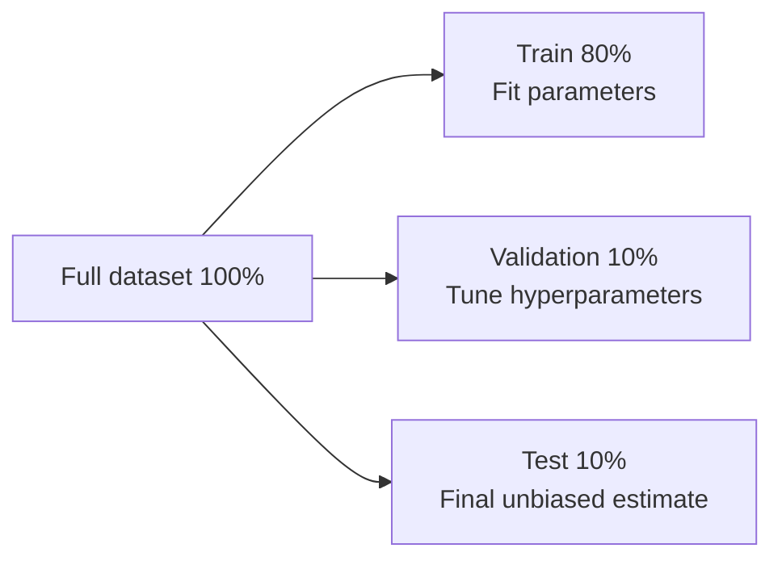

## Mini-report – Machine Learning Models (Supervised, Unsupervised, Reinforcement)

### Abstract
Machine learning (ML) refers to methods that learn from data to predict quantities, assign classes, discover structure, or support decisions. This mini-report focuses on **supervised learning**, and briefly outlines **unsupervised learning** and **reinforcement learning**.

### 1. Introduction: what is an ML “model”?
An ML model is a parameterized function $f_\theta$ that maps an input vector of features $\mathbf{x}$ to an output $\hat{y}$. In regression, $\hat{y}$ is real-valued; in classification, $\hat{y}$ is a label or a probability. Learning selects parameters $\theta$ that minimize a loss function $\mathcal{L}$ measuring the discrepancy between $\hat{y}$ and ground truth $y$, with the key goal of **generalization** to unseen data.

### 2. Supervised Machine Learning
#### 2.1. Data, objective, and generalization
In supervised learning, the dataset is composed of labeled pairs $\mathcal{D} = \{(\mathbf{x}_i, y_i)\}_{i=1}^n$. The feature vector $\mathbf{x}$ aggregates explanatory variables (sensor readings, operational settings, geological descriptors, and so on), while $y$ is the target variable to predict. The learning task is to infer a mapping from inputs to targets that remains accurate beyond the training examples, which requires both sound methodology and careful evaluation.

#### 2.2. Modeling workflow (pipeline)
A typical supervised workflow is to define the target and constraints, prepare the data (cleaning, missing values, encoding), and split the dataset to measure generalization. Models are usually built from simple baselines to more expressive approaches, and compared using consistent metrics.

One of the most common pitfalls is **data leakage**: using information that would not be available at prediction time (or that indirectly encodes the label). Leakage produces overly optimistic evaluation scores and leads to poor real-world performance.

#### 2.3. Train/validation/test split
Data splitting organizes evaluation by **reserving unseen data** for honest generalization checks.

- **Typical numeric split (example):** Train = **80%**, Validation = **10%**, Test = **10%**.
- **Training set:** used to fit the model parameters $\theta$.
- **Validation set:** used to choose the model family and tune hyperparameters (e.g., number of trees, depth, regularization strength).
- **Test set:** used **once at the end** to report the final expected performance.

For time-dependent data, shuffling across time can accidentally mix past and future; **chronological splits** (train on earlier samples, validate/test on later samples) are usually preferred to preserve realism.

#### 2.4. Loss functions and learning
Training typically solves an optimization problem of the form $\min_\theta \frac{1}{n}\sum_{i=1}^n \mathcal{L}(f_\theta(\mathbf{x}_i), y_i)$. In regression, common losses include MSE (more sensitive to large errors) and MAE (often more robust). Optimization depends on the model family (e.g., gradient-based methods for neural networks, iterative solvers for SVMs).

#### 2.5. Major families of supervised models
Below are common **supervised regression** models (often used for tabular engineering datasets), including the ones typically considered for projects where the target is continuous.

##### 2.5.1. Linear Regression (baseline)
Linear regression predicts with a weighted sum of features:
$$\hat{y} = w_0 + \sum_{j=1}^{p} w_j x_j$$
It is fast, interpretable, and a strong baseline. It can underfit when relationships are highly nonlinear.

The figure summarizes the idea: the prediction is a **single linear combination** of the input features, which makes the model easy to interpret and a strong baseline for comparison.

##### 2.5.2. Random Forest Regression (key model)
Random Forest combines many decision trees trained on bootstrapped samples and random subsets of features. The final prediction is an **average** across trees. This often performs well on tabular data and reduces overfitting compared to a single tree.

As shown in the figure, many trees are trained in parallel and then **averaged**, which typically improves robustness and generalization compared to one decision tree.

##### 2.5.3. Gradient Boosting (often strong on tabular data)
Boosting builds trees **sequentially**: each new tree learns to correct the errors (residuals) of the previous ensemble. It can achieve very high accuracy but requires careful tuning (learning rate, depth, number of estimators).

The figure highlights the sequential nature: each new weak model focuses on **reducing the previous errors**, which can yield strong accuracy on tabular datasets when properly tuned.

##### 2.5.4. Support Vector Regression (SVR)
SVR fits a function that keeps errors within an $\varepsilon$-tube when possible, and can use kernels to model nonlinearity. It can work well in high-dimensional settings but may be costly for large datasets.

As illustrated, SVR aims to fit a function so that most points fall **within an $\varepsilon$ tolerance band**, relying on a subset of points (support vectors) that define the solution.

##### 2.5.5. XGBoost (Gradient Boosting implementation)
XGBoost is a widely used, efficient implementation of gradient-boosted decision trees with additional regularization and optimized training. It is often a strong choice for **tabular** regression problems.

The figure reflects boosted trees added one after another: XGBoost is essentially **gradient boosting with optimized training and regularization**, often achieving strong performance on tabular regression.

##### 2.5.6. RVM (Relevance Vector Machine)
RVM is a Bayesian sparse model that is conceptually related to SVM/SVR but often yields a **sparser** solution (fewer “relevance vectors”) while producing probabilistic outputs in some formulations. It can be useful when you want kernel-based nonlinearity with sparsity.

The figure emphasizes the key idea: after a kernel mapping, a Bayesian mechanism selects a **small set of relevance vectors**, yielding a sparse model that can be easier to deploy than dense kernel methods.

In practice, a common approach is: start with **Linear/Ridge** as a baseline, then compare to **Random Forest / Extra Trees** and **Boosting (e.g., XGBoost)** as stronger nonlinear models, using the same splits and metrics.

#### 2.6. Evaluation: $R^2$, $R$, MSE, RMSE, and MAE
In regression, error magnitude is summarized with **MSE** and **MAE**, while **RMSE** ($\sqrt{\mathrm{MSE}}$) expresses error in the same unit as the target. Goodness of fit is often reported with:

- $R^2 = 1-\frac{\sum_i (y_i-\hat{y}_i)^2}{\sum_i (y_i-\bar{y})^2}$ (comparison to a mean predictor)
- the correlation coefficient $R$ between $y$ and $\hat{y}$ (how well variations track each other)

The key point is that each metric has a **value range** and a typical interpretation:

| Metric | Range | Better when… | How to interpret values |
|---|---:|---|---|
| $R^2$ | $(-\infty, 1]$ | closer to **1** | $1$ = perfect; $0$ = same as predicting the mean; negative = worse than the mean baseline |
| $R$ | $[-1, 1]$ | closer to **+1** | $+1$ = perfect positive linear association; $0$ = no linear association; $-1$ = perfect inverse association |
| MSE | $[0, +\infty)$ | closer to **0** | $0$ = perfect; scale depends on target units squared; sensitive to large errors (outliers) |
| RMSE | $[0, +\infty)$ | closer to **0** | $0$ = perfect; in same unit as $y$; compare RMSE to the typical magnitude/variation of $y$ |
| MAE | $[0, +\infty)$ | closer to **0** | $0$ = perfect; in same unit as $y$; more robust than MSE to large outliers |

Practical reading examples (on the **validation/test** split):

- If $R^2 \approx 0.80$, the model explains about **80% of the variance** of $y$ relative to the mean baseline on that split.
- If $R$ is close to **1**, predictions track the ups/downs of $y$ well; if $R$ is near **0**, the model may not capture the main trend.
- If RMSE/MAE are small **relative to the target scale** (e.g., small compared to the typical range or standard deviation of $y$), the model is accurate in absolute terms.

Because MSE/RMSE/MAE depend on the scale of $y$, comparisons are most meaningful when:

1) you compare multiple models on the **same split**, and/or
2) you compare to a simple baseline (mean predictor, linear regression), and/or
3) you report an additional normalized metric (e.g., RMSE divided by the range or standard deviation of $y$).

#### 2.7. Overfitting, bias–variance, and regularization
Underfitting happens when the model is too simple; overfitting happens when it is too flexible and generalizes poorly. Regularization (Ridge/Lasso, early stopping, tree constraints) and cross-validation help improve generalization.

#### 2.8. Features, scaling, and robustness
On tabular problems, feature design often dominates performance; transformations, aggregations, and interactions can help. Scaling is essential for distance- or magnitude-sensitive models (kNN, SVM, regularized linear models) and less critical for tree-based models.

#### 2.9. Interpretability and uncertainty
Interpretability can be global (feature importance, average effects) or local (explaining a single prediction). Tools such as SHAP are commonly used; depending on the use case, uncertainty can be quantified with prediction intervals or calibration.

### 3. Unsupervised Machine Learning
Unsupervised learning has no target label and focuses on structure discovery through clustering, dimensionality reduction, and anomaly detection. Evaluation is often indirect and relies on stability checks and domain expertise.

### 4. Reinforcement Learning
RL learns a policy for sequential decisions: an agent observes $s_t$, chooses $a_t$, and receives rewards, aiming to maximize a discounted return $G_t = \sum_{k=0}^{\infty} \gamma^k r_{t+k}$. RL is powerful for control tasks but is more demanding in practice (exploration/exploitation, large interaction needs, safety constraints).

### 5. Conclusion
Supervised ML is usually the most direct framework for predicting a target from labeled data. Unsupervised learning complements it by uncovering structure and anomalies, while RL is suitable for sequential decision-making when long-term objectives must be optimized under constraints.
