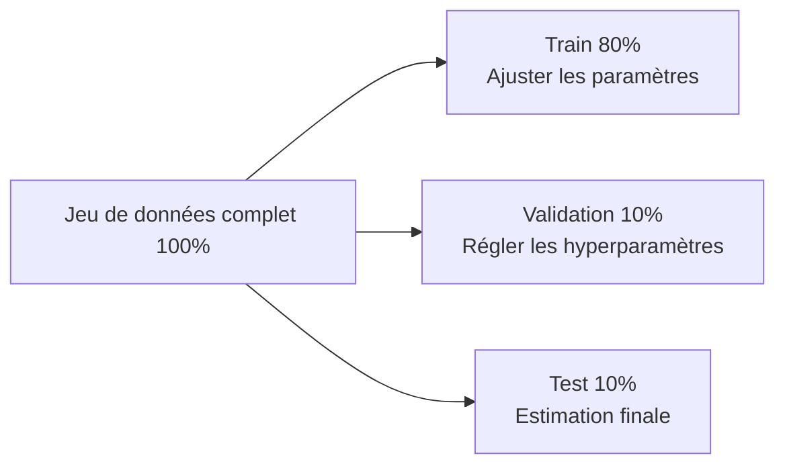
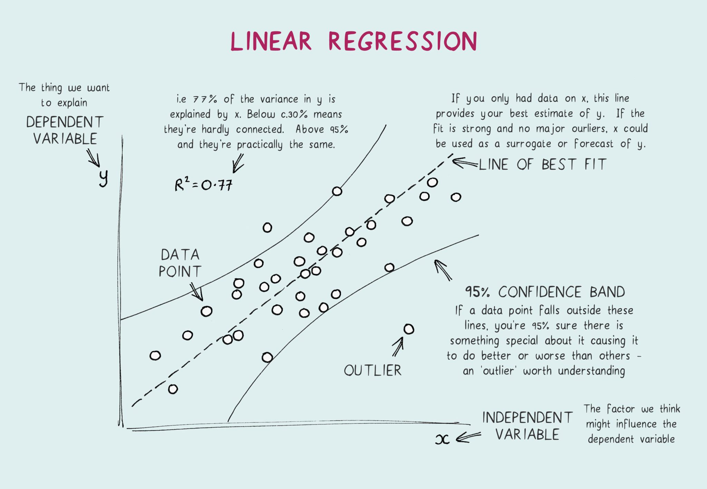
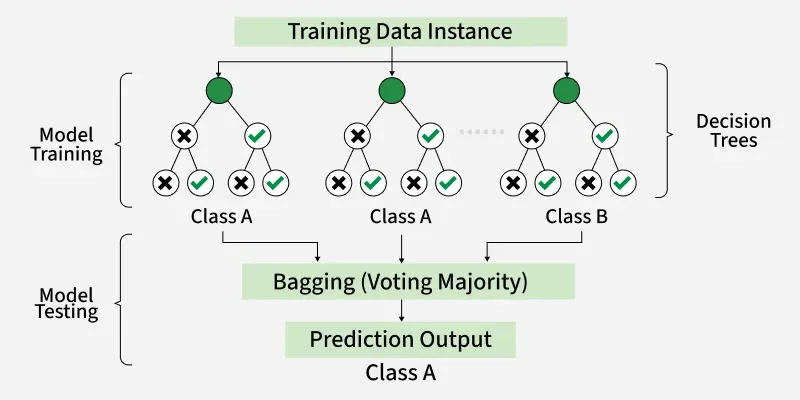
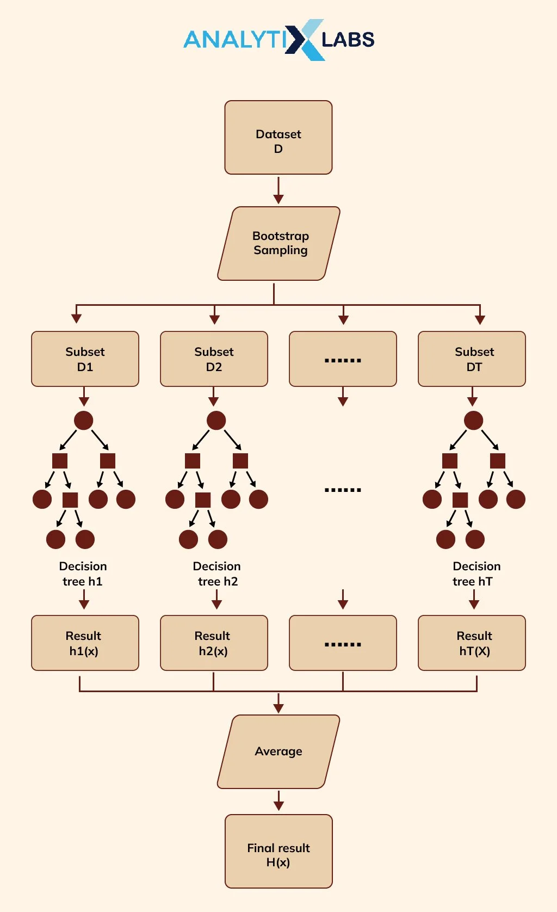
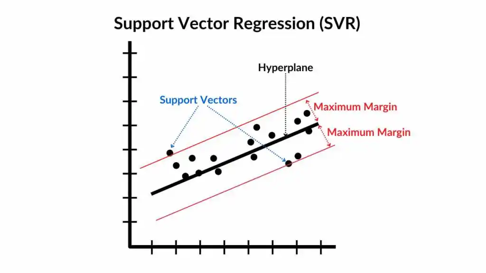
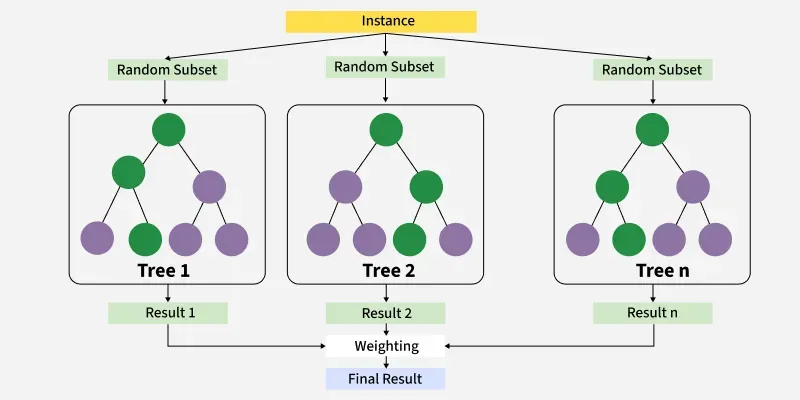
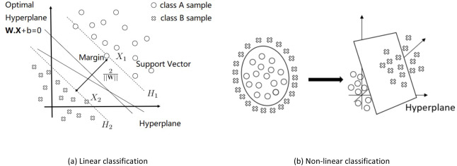

## Mini-report – Modèles de Machine Learning (Supervised, Unsupervised, Reinforcement)

### Résumé
Le machine learning (ML) regroupe des méthodes qui apprennent à partir de données afin de prédire une quantité, attribuer une classe ou structurer l’information. Ce mini-report se concentre sur le **supervised machine learning** (apprentissage supervisé), puis présente brièvement le **unsupervised machine learning** (apprentissage non supervisé) et le **reinforcement learning** (apprentissage par renforcement).

### 1. Introduction : qu’est-ce qu’un « modèle » en ML ?
Un modèle de ML est une fonction paramétrée $f_\theta$ qui transforme des entrées (features) $\mathbf{x}$ en une sortie $\hat{y}$. En régression, $\hat{y}$ est une valeur réelle (par exemple un taux, un coût ou une durée) ; en classification, $\hat{y}$ est une étiquette ou une probabilité. L’apprentissage consiste à ajuster $\theta$ pour minimiser une perte $\mathcal{L}$ qui mesure l’écart entre $\hat{y}$ et la vérité terrain $y$, avec un objectif central : bien **généraliser** sur de nouvelles données.

### 2. Supervised Machine Learning
#### 2.1. Données, objectif et généralisation
En apprentissage supervisé, on dispose d’exemples étiquetés sous la forme $\mathcal{D} = \{(\mathbf{x}_i, y_i)\}_{i=1}^n$. Les entrées $\mathbf{x}$ regroupent des variables explicatives (capteurs, paramètres opérationnels, variables géologiques, etc.) et la cible $y$ correspond à la quantité à prédire. L’objectif est d’apprendre une règle qui fonctionne sur de nouvelles observations, ce qui implique de maîtriser à la fois la qualité des données, le choix du modèle et la méthodologie d’évaluation.

#### 2.2. Démarche de modélisation (pipeline)
Une démarche supervisée robuste est généralement la suivante : définir précisément la cible et les contraintes, préparer les données (nettoyage, valeurs manquantes, encodage), puis séparer les données pour mesurer la généralisation. On entraîne d’abord des baselines, puis des modèles plus expressifs, et l’on compare les résultats avec des métriques adaptées.

Une source d’erreur classique est la **fuite de données** (data leakage) : il s’agit d’utiliser, volontairement ou non, une information qui ne serait pas disponible au moment de la prédiction (par exemple une variable calculée avec des informations futures, ou une transformation qui « mélange » train et test). La fuite de données conduit à des scores artificiellement élevés et à des modèles décevants en conditions réelles.

#### 2.3. Découpage train/validation/test
Le découpage des données structure l’évaluation en **réservant des données jamais vues** afin d’estimer la généralisation.

- **Découpage numérique typique (exemple) :** Train = **80%**, Validation = **10%**, Test = **10%**.
- **Train :** sert à ajuster les paramètres $\theta$ du modèle.
- **Validation :** sert à choisir la famille de modèle et à régler les hyperparamètres (p. ex. profondeur d’arbre, nombre d’arbres, force de régularisation).
- **Test :** sert **une seule fois à la fin** pour rapporter une performance finale non biaisée.



Pour des données temporelles, il est essentiel de respecter la chronologie (train sur le passé, validation/test sur le futur) afin d’éviter de mélanger passé et futur.

#### 2.4. Fonctions de perte et apprentissage
Apprendre un modèle revient à résoudre un problème d’optimisation du type $\min_\theta \frac{1}{n}\sum_{i=1}^n \mathcal{L}(f_\theta(\mathbf{x}_i), y_i)$. En régression, des pertes courantes sont la MSE (qui accentue les grandes erreurs) et la MAE (souvent plus robuste). L’algorithme d’optimisation dépend du modèle : descente de gradient pour les réseaux de neurones, procédures itératives pour les SVM, ou solutions analytiques/quasi-analytiques pour certains modèles linéaires.

#### 2.5. Principales familles de modèles supervisés
Ci-dessous, des modèles courants pour la **régression supervisée** (fréquente sur données tabulaires), y compris ceux typiquement considérés dans des projets où la cible est continue.

##### 2.5.1. Régression linéaire (baseline)
La régression linéaire prédit via une somme pondérée des variables :
$$\hat{y} = w_0 + \sum_{j=1}^{p} w_j x_j$$
Elle est rapide, interprétable, et constitue une excellente baseline. Elle peut sous-ajuster si la relation est très non linéaire.



Comme sur le schéma, la prédiction est une **combinaison linéaire** des features : c’est très interprétable et une baseline solide pour comparer les modèles plus complexes.

##### 2.5.2. Modèles linéaires régularisés (Ridge / Lasso)
Ridge et Lasso limitent le surapprentissage en pénalisant les poids trop grands.

- **Ridge (L2) :** réduit les poids de façon continue (utile si les variables sont corrélées).
- **Lasso (L1) :** peut mettre certains poids **exactement à zéro** (sélection de variables).

```mermaid
flowchart LR
  A[Modèle linéaire] --> B[Ajouter un terme\nλ·||w||]
  B --> C[Poids plus stables\nMeilleure généralisation]
```


##### 2.5.4. Random Forest (modèle clé)
La Random Forest combine de nombreux arbres entraînés sur des échantillons bootstrap et des sous-ensembles aléatoires de variables. La prédiction finale est une **moyenne** des prédictions des arbres. Elle est souvent très performante sur données tabulaires et réduit le surapprentissage par rapport à un arbre unique.



Le schéma illustre le principe : plusieurs arbres sont entraînés en parallèle puis **moyennés**, ce qui rend le modèle plus robuste qu’un arbre seul.

##### 2.5.5. Gradient Boosting (souvent très fort sur tabulaire)
Le boosting construit des arbres **séquentiellement** : chaque nouvel arbre apprend à corriger les erreurs (résidus) de l’ensemble précédent. Il peut atteindre une excellente précision, mais nécessite un réglage fin (learning rate, profondeur, nombre d’estimateurs).



Le schéma met en évidence la construction séquentielle : chaque arbre vise à **réduire les erreurs** du précédent, ce qui peut donner d’excellents résultats sur données tabulaires.

##### 2.5.6. Support Vector Regression (SVR)
La SVR ajuste une fonction qui maintient les erreurs dans un tube $\varepsilon$ quand c’est possible, et peut utiliser des noyaux (kernels) pour modéliser des non-linéarités. Elle peut être performante en haute dimension mais devient coûteuse quand le volume de données augmente.



Comme sur le schéma, la SVR cherche une fonction telle que la plupart des points soient **dans une bande de tolérance** $\varepsilon$, et la solution est déterminée par quelques points clés (support vectors).

##### 2.5.7. XGBoost (implémentation de Gradient Boosting)
XGBoost est une implémentation très utilisée et optimisée des arbres boostés (gradient boosting), avec des mécanismes de régularisation supplémentaires et un entraînement efficace. Il est souvent un excellent choix pour la régression sur données **tabulaires**.



Le schéma correspond à du boosting : on ajoute des arbres qui corrigent progressivement les erreurs, et XGBoost apporte une **optimisation + régularisation** qui le rend souvent très performant.

##### 2.5.9. RVM (Relevance Vector Machine)
Le RVM est un modèle bayésien parcimonieux, conceptuellement proche des SVM/SVR, mais qui produit souvent une solution plus **sparse** (peu de “relevance vectors”) et peut fournir des sorties probabilistes selon les formulations. Il peut être utile si l’on souhaite une non-linéarité par noyau tout en favorisant la parcimonie.



Le schéma montre l’idée : après une projection par noyau, un mécanisme bayésien sélectionne peu de **relevance vectors**, ce qui donne souvent un modèle plus parcimonieux qu’un SVR dense.

En pratique : démarrer avec **linéaire/Ridge** (baseline), puis comparer à **Random Forest / Extra Trees** et **Boosting (p. ex. XGBoost)** (modèles non linéaires) en gardant les mêmes splits et les mêmes métriques.

#### 2.6. Évaluation : $R^2$, $R$, MSE, RMSE et MAE
En régression, on résume l’erreur avec la **MSE** et la **MAE**, tandis que la **RMSE** ($\sqrt{\mathrm{MSE}}$) remet l’erreur dans l’unité de la cible. La qualité d’ajustement est souvent décrite par :

- $R^2 = 1-\frac{\sum_i (y_i-\hat{y}_i)^2}{\sum_i (y_i-\bar{y})^2}$ (comparaison à un prédicteur constant égal à la moyenne)
- le coefficient de corrélation $R$ entre $y$ et $\hat{y}$ (à quel point les variations prédites suivent les variations réelles)

L’essentiel est que chaque métrique a une **plage de valeurs** et une interprétation typique :

| Métrique | Plage | Mieux quand… | Interprétation |
|---|---:|---|---|
| $R^2$ | $(-\infty, 1]$ | proche de **1** | $1$ = parfait ; $0$ = équivalent à prédire la moyenne ; négatif = pire que la baseline moyenne |
| $R$ | $[-1, 1]$ | proche de **+1** | $+1$ = association linéaire positive parfaite ; $0$ = pas d’association linéaire ; $-1$ = association inverse parfaite |
| MSE | $[0, +\infty)$ | proche de **0** | $0$ = parfait ; dépend de l’unité (au carré) ; très sensible aux grosses erreurs (outliers) |
| RMSE | $[0, +\infty)$ | proche de **0** | $0$ = parfait ; même unité que $y$ ; comparer la RMSE à la variabilité typique de $y$ |
| MAE | $[0, +\infty)$ | proche de **0** | $0$ = parfait ; même unité que $y$ ; plus robuste que la MSE aux outliers |

Exemples de lecture (sur le **split validation/test**) :

- Si $R^2 \approx 0{,}80$, le modèle explique environ **80% de la variance** de $y$ par rapport à la baseline moyenne sur ce split.
- Si $R$ est proche de **1**, les prédictions suivent bien les hausses/baisses de $y$ ; si $R$ est proche de **0**, le modèle ne capture probablement pas la tendance principale.
- Si RMSE/MAE sont faibles **au regard de l’échelle de la cible** (p. ex. faibles par rapport à l’étendue ou l’écart-type de $y$), le modèle est précis en valeur absolue.

Comme MSE/RMSE/MAE dépendent de l’échelle de $y$, les comparaisons sont surtout pertinentes quand :

1) on compare plusieurs modèles sur le **même split**, et/ou
2) on compare à une baseline simple (moyenne, régression linéaire), et/ou
3) on rapporte une métrique normalisée (p. ex. RMSE divisée par l’étendue ou l’écart-type de $y$).

#### 2.7. Surapprentissage, biais-variance et régularisation
Un modèle trop simple sous-apprend, tandis qu’un modèle trop flexible sur-apprend (excellent sur train mais moins bon sur test). La régularisation (Ridge/Lasso, early stopping, contraintes sur les arbres, etc.) et la validation croisée aident à améliorer la généralisation.

#### 2.8. Features, normalisation et robustesse
La qualité des features est souvent déterminante : transformations (log, ratios), agrégations et interactions peuvent améliorer la prédiction. La standardisation est importante pour les modèles sensibles à l’échelle (kNN, SVM, régressions régularisées), et moins critique pour les arbres.

#### 2.9. Interprétabilité et incertitude
L’explicabilité peut être globale (variables importantes, effets moyens) ou locale (explication d’une prédiction). Des outils comme SHAP aident à interpréter les modèles ; selon le contexte, on peut aussi estimer l’incertitude (intervalles de prédiction, calibration).

### 3. Unsupervised Machine Learning
En non supervisé, il n’y a pas de cible $y$ : on cherche à structurer les données via le clustering (k-means, DBSCAN/HDBSCAN), la réduction de dimension (PCA/UMAP) et la détection d’anomalies (Isolation Forest, One-Class SVM). L’évaluation est souvent plus indirecte et s’appuie sur la stabilité des résultats et l’expertise métier.

### 4. Reinforcement Learning
Le RL apprend une politique de décision séquentielle : un agent observe un état $s_t$, choisit une action $a_t$ et reçoit une récompense, avec l’objectif de maximiser un retour cumulé $G_t = \sum_{k=0}^{\infty} \gamma^k r_{t+k}$. Il est puissant pour des problèmes de contrôle, mais souvent plus coûteux à mettre en œuvre (exploration/exploitation, besoin de simulateur, contraintes de sécurité).

### 5. Conclusion
Le supervised ML est généralement le cadre le plus direct pour prédire une cible à partir de données étiquetées. Le non supervisé complète l’analyse en révélant des structures et des anomalies, tandis que le RL est adapté aux décisions séquentielles quand un objectif de long terme doit être optimisé sous contraintes.