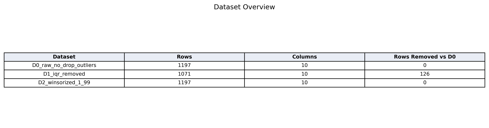
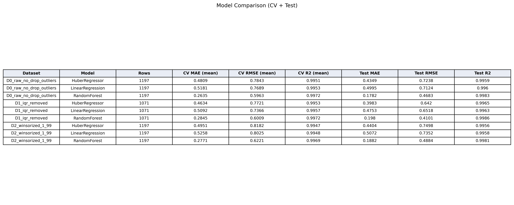
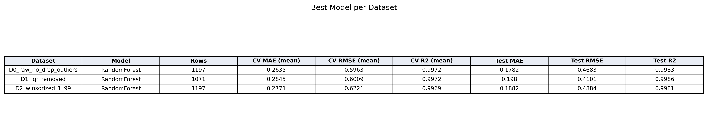
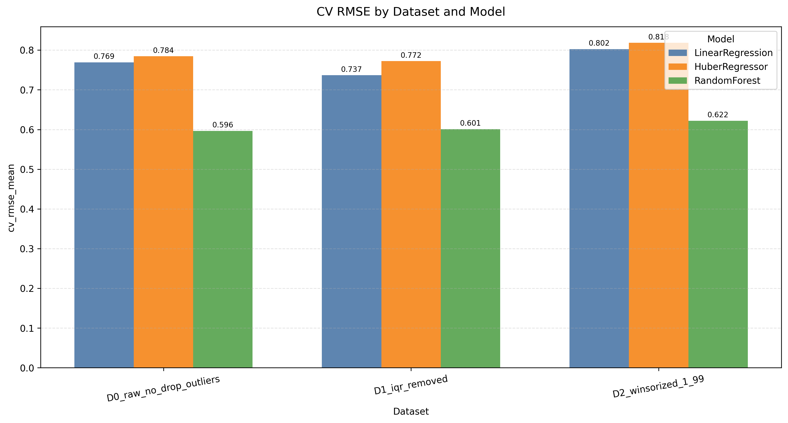
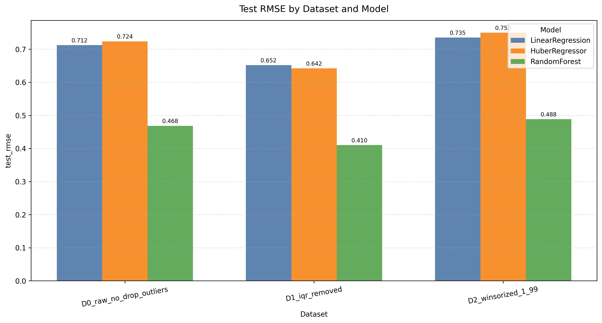
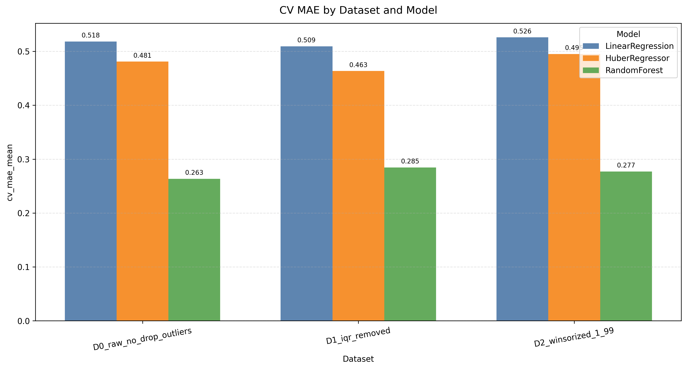
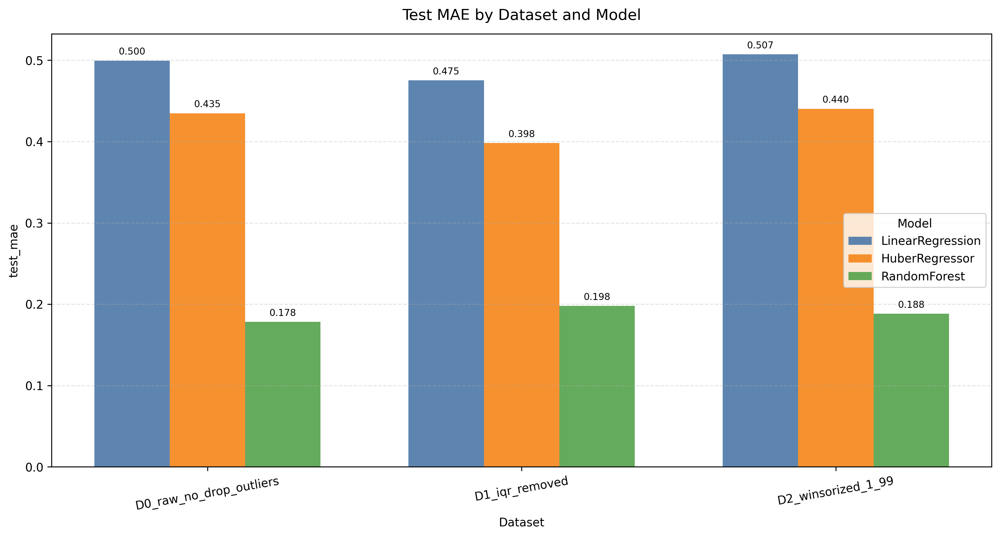
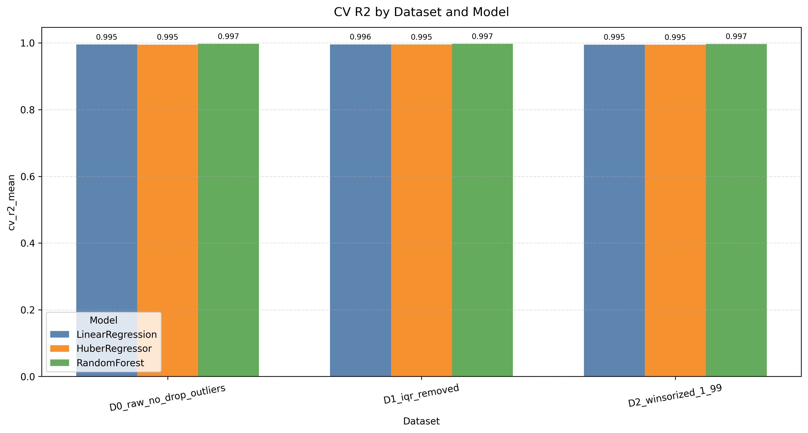

# Report 2: Data Preprocessing and Exploratory Data Analysis

## 1. Data Preprocessing

Prior to any exploratory or modeling steps, the raw dataset underwent a rigorous preprocessing phase to ensure data quality and reliability. The following steps were systematically applied:

### 1.1 Handling Missing Values
All rows containing at least one missing value were removed from the dataset. This approach, while potentially reducing the dataset size, ensures that no imputation bias is introduced and that subsequent analyses are based on complete cases only. This is particularly important for machine learning models that are sensitive to missing data.

### 1.2 Outlier handling (comparative strategy)
Outlier treatment was not imposed as a single rule from the outset. Candidate outliers were first identified during the exploratory boxplot inspection (Section 3.2), then evaluated through a comparative strategy to quantify their actual effect on PR prediction:

- D0: outliers retained,
- D1: outliers removed with the IQR method,
- D2: extreme values capped using winsorization (1%-99%).

This design supports a data-driven decision based on predictive performance rather than an a priori assumption.

### 1.3 Data Normalization
The remaining numerical features were standardized using the StandardScaler method, which transforms each feature to have a mean of zero and a standard deviation of one. This normalization is essential for algorithms that are sensitive to the scale of input data, such as those based on distance metrics or regularization.

### 1.4 Export of preprocessed datasets
Preprocessed datasets were exported to ensure reproducibility and traceability of subsequent analyses:

- reference dataset for EDA and modeling: D0,
- comparative datasets for impact analysis: D1 and D2.

Associated comparison tables are stored in the outlier_study folder.

As a result, the reference dataset (D0) is ready for exploratory analysis and model development, while D1 and D2 are retained for methodological comparison.

### 1.5 Outlier Impact Study for PR Prediction
To determine whether extreme values are harmful or informative for PR prediction, a comparative study was conducted on three dataset variants:

- D0: cleaned data without outlier removal (1197 rows)
- D1: IQR-based outlier removal (1071 rows, 126 removed rows)
- D2: winsorization at 1%-99% (1197 rows)

Three models were evaluated under the same protocol on D0, D1, and D2: Linear Regression, Huber Regressor, and Random Forest.
The selected metrics were MAE, RMSE, and R2 in cross-validation and on a hold-out test set.

Results show that Random Forest is the best model across all dataset variants. In cross-validation, D0 provides the best overall trade-off (lowest mean RMSE: 0.596). On the test split, D1 yields the lowest RMSE (0.410), suggesting that IQR filtering can improve prediction for less extreme samples.

These findings indicate that outliers are not purely detrimental:

- they can degrade some linear models,
- they may still carry useful information,
- and removing them changes the problem distribution.

Methodologically, the final decision for the next stage is to use D0 (dataset with retained outliers) as the single reference dataset. This choice is justified by its best overall cross-validation performance, its larger sample size, and the preservation of potentially informative extreme observations for PR prediction.

The result tables used for this analysis are available in the outlier_study folder: dataset_overview.csv, model_comparison_cv_test.csv, and best_model_per_dataset.csv.

### 1.6 Visual Results of the Outlier Impact Study

#### 1.6.1 Dataset structure after outlier handling

Interpretation of the data:

- `Rows` indicates the number of available learning samples after preprocessing.
- `Rows Removed vs D0` quantifies information loss relative to the full reference set.

The table shows that D1 removes 126 observations (about 10.5% of D0), whereas D0 and D2 preserve all 1197 samples. This is important because sample-size reduction can lower model robustness and reduce coverage of rare operating regimes.

#### 1.6.2 Model comparison tables

How to read these tables:

- `CV MAE (mean)` and `CV RMSE (mean)` are average prediction errors across cross-validation folds (lower is better).
- `CV R2 (mean)` is explained variance in cross-validation (higher is better).
- `Test MAE`, `Test RMSE`, and `Test R2` are measured on the hold-out test split.

Main result: RandomForest is the best model for all three datasets. This indicates that non-linear tree-based modeling is more suitable than purely linear formulations for PR prediction.

#### 1.6.3 Score charts with annotated values

Detailed interpretation:

- For RandomForest, CV RMSE is lowest on D0 (0.596), then D1 (0.601), then D2 (0.622).
- Because CV performance averages multiple folds, this is the primary criterion for model/dataset selection.
- This supports D0 as the best global compromise between accuracy and data retention.

On the single hold-out test split, D1 gives the lowest RandomForest RMSE (0.410 vs 0.468 on D0 and 0.488 on D2). This indicates that IQR filtering can improve performance in some test partitions, but this improvement is not dominant in cross-validation.

MAE trends are consistent with RMSE:

- D0 is strongest in cross-validation for RandomForest (CV MAE = 0.263).
- D1 is best on test MAE for linear and robust linear models, but RandomForest remains the best absolute performer overall.

R2 values are uniformly high (around 0.995-0.999), so discrimination between options should rely mainly on error metrics (MAE/RMSE) and dataset representativeness.

Final interpretation:

- D0 offers the best overall cross-validated error profile,
- D0 preserves full sample diversity,
- D1 shows local test-split gains but with non-negligible data removal,
- D2 does not outperform D0.

Therefore, D0 remains the most scientifically defensible reference dataset for the next modeling stage.

## 2. Exploratory Data Analysis (EDA)

### 2.1 Objective and workflow
In accordance with the Week 4 plan, EDA was conducted to characterize the statistical structure of the selected dataset (D0), identify relationships between PR and explanatory variables, and guide regression model selection. The following analyses were performed:

- univariate visualization (histograms),
- extreme-value inspection (boxplots),
- bivariate visualization of PR versus predictors (scatter plots),
- correlation analysis (Spearman matrix),
- preparation of a train/test split protocol.

### 2.2 Univariate distributions
Histogram analysis shows heterogeneous distributions across variables:

- CRS and AR are concentrated in specific operational ranges,
- F/A, T/D3, UEP, and LEP are more spread,
- SE, FPI, and TPI are right-skewed with long tails,
- PR is non-Gaussian, with concentration at low-to-intermediate values and a smaller number of high values.

These patterns confirm a non-linear data structure and motivate robust modeling choices beyond purely linear assumptions.

### 2.3 Boxplots and interpretation of extreme values
Boxplots reveal extreme observations, especially for SE, FPI, and TPI. From an operational and geotechnical perspective, these points can represent difficult excavation regimes (high specific energy and lower penetration) rather than systematic measurement errors.

Consistent with the outlier-impact study (Section 1.5), this supports retaining D0 as the reference dataset to preserve potentially informative operating conditions for PR prediction.

### 2.4 PR versus predictors
Scatter plots of PR against predictors highlight:

- a strong positive relationship between AR and PR,
- strong negative relationships between PR and SE/FPI/TPI,
- more complex non-linear relationships for F/A, T/D3, UEP, and LEP,
- an overall negative trend between CRS and PR over the observed range.

The observed cloud structures and non-linear patterns indicate that purely linear models may be insufficient to capture the full system behavior.

### 2.5 Correlation analysis (Spearman)
The Spearman correlation matrix confirms visual trends and quantifies monotonic dependencies:

- corr(AR, PR) = 0.98 (very strong positive),
- corr(CRS, PR) = -0.57 (moderate-to-strong negative),
- corr(SE, PR) = -0.85, corr(FPI, PR) = -0.86, corr(TPI, PR) = -0.85,
- corr(F/A, PR) = -0.26, corr(T/D3, PR) = -0.36,
- corr(UEP, PR) = -0.04, corr(LEP, PR) = -0.13.

High inter-feature correlations are also present (e.g., SE-FPI-TPI and UEP-LEP), indicating partial multicollinearity. This property was considered in the model-selection strategy (Section 1.5).

### 2.6 Train/test split strategy
To prepare the modeling phase, data were split into training and testing sets using an 80/20 hold-out design, combined with 5-fold cross-validation on the training set. This protocol provides:

- robust generalization assessment,
- fair comparison across regression methods,
- reduced overfitting risk.

### 2.7 EDA summary
EDA confirms that PR prediction is a non-linear regression problem with interacting variables and informative extreme regimes. Week 4 results therefore support the following decisions:

- retain D0 as the reference dataset,
- prioritize robust/non-linear models,
- interpret model quality through both predictive metrics and physical plausibility.

## 3. Detailed Interpretation of the 4 Main EDA Plots

### 3.1 Plot 1 - Histograms of variables

**Purpose of this plot**
Histograms describe the distribution of each variable (shape, skewness, concentration, and spread), which is essential for model selection and for checking statistical assumptions.

**Observed patterns**
- SE, FPI, and TPI are strongly right-skewed, with long upper tails.
- PR is not normally distributed; most observations lie in low-to-mid ranges.
- CRS and AR show concentrated operating bands, suggesting preferred operational regimes.

**Scientific conclusion**
The data are non-Gaussian and heterogeneous across features. This supports the use of robust and non-linear methods rather than relying only on strict linear-normal assumptions.

### 3.2 Plot 2 - Boxplots (spread and extreme values)

**Purpose of this plot**
Boxplots summarize median, quartiles, interquartile spread, and extreme observations. They are used to assess variability and identify potentially atypical operating regimes.

**Observed patterns**
- SE, FPI, and TPI exhibit wide spread with many extreme observations.
- UEP and LEP are more concentrated within narrower ranges.
- PR itself shows substantial variability between low-penetration and high-penetration regimes.

**Scientific conclusion**
Extreme observations should not be treated as noise by default. In TBM operations, they may represent difficult geological or operational states. This is consistent with the decision to retain D0 as the reference dataset.

### 3.3 Plot 3 - Scatter plots of PR vs predictors

**Purpose of this plot**
Scatter plots reveal the functional form of relationships between PR (target) and each predictor: linearity, non-linearity, saturation effects, heteroscedasticity, and regime clustering.

**Observed patterns**
- AR and PR show a strong increasing trend.
- SE, FPI, and TPI show strong inverse relationships with PR.
- F/A, T/D3, UEP, and LEP display non-linear and multi-regime behavior.
- CRS shows an overall negative trend with PR in the observed range.

**Scientific conclusion**
PR depends on mixed linear and non-linear effects with implicit interactions among predictors. Therefore, non-linear models (e.g., Random Forest) are more appropriate than simple linear models.

### 3.4 Plot 4 - Spearman correlation matrix

**Purpose of this plot**
The Spearman heatmap quantifies monotonic dependencies, including relationships that are not strictly linear.

**Main quantitative results**
- corr(AR, PR) = 0.98: very strong positive relationship.
- corr(CRS, PR) = -0.57: moderate-to-strong negative relationship.
- corr(SE, PR) = -0.85, corr(FPI, PR) = -0.86, corr(TPI, PR) = -0.85: strong negative relationships.
- corr(F/A, PR) = -0.26 and corr(T/D3, PR) = -0.36: moderate negative effects.
- corr(UEP, PR) = -0.04 and corr(LEP, PR) = -0.13: weak direct effect on PR.

**Scientific conclusion**
PR prediction is mainly driven by AR, SE, FPI, and TPI. Strong inter-feature correlations (notably SE-FPI-TPI) indicate partial multicollinearity, reinforcing the choice of robust models and strict validation protocols.

### 3.5 Overall EDA conclusion (Week 4)
The four-plot analysis shows that PR is governed by non-linear behavior, contrasted operating regimes, and informative extreme values. The direct implications for the next stage are:

- retain D0 as the reference dataset,
- prioritize robust/non-linear models,
- validate with train/test split and cross-validation to ensure generalization.
