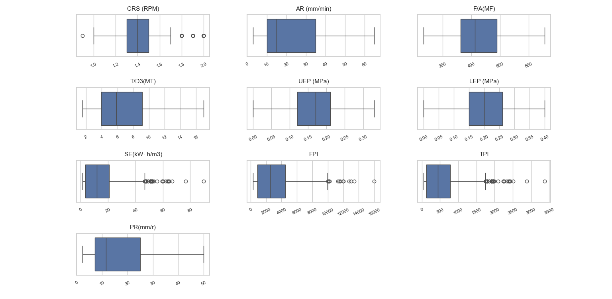
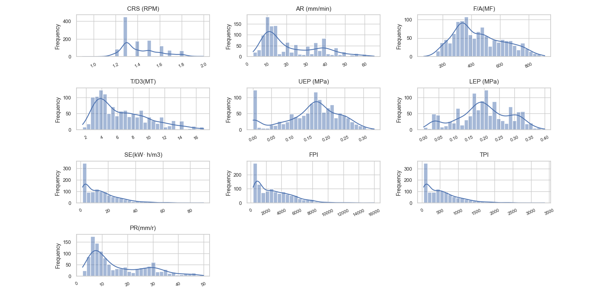
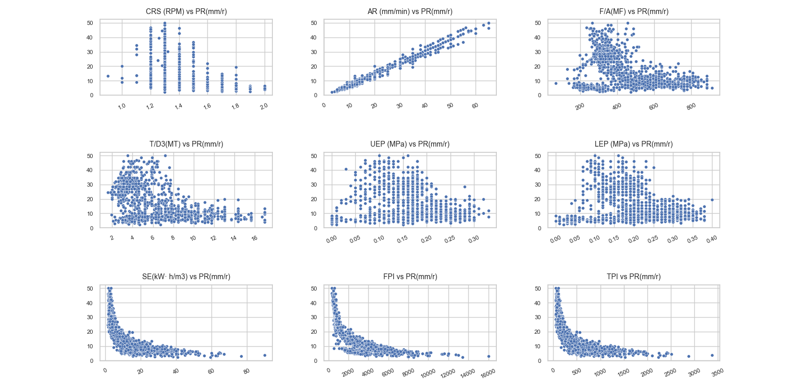
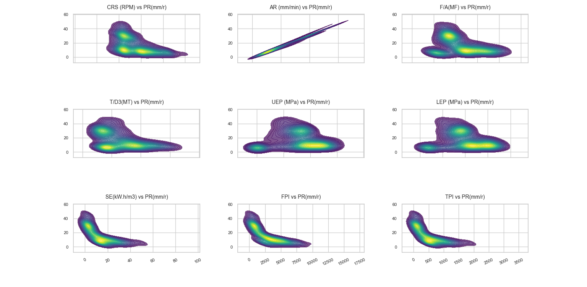
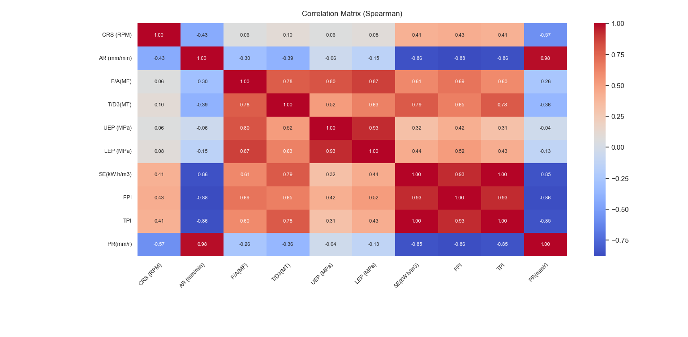

# Rapport 2 : Prétraitement des données et Analyse exploratoire

## Introduction
Ce rapport présente en détail les étapes de prétraitement des données et l’analyse exploratoire réalisées dans le cadre de l’étude sur la prédiction du taux de progression (PR) des tunneliers. L’objectif est de préparer un jeu de données fiable et d’explorer les relations entre le PR et les paramètres influents, afin de mieux comprendre les facteurs déterminants pour la modélisation future.

## Prétraitement des données
La première étape a consisté à examiner le jeu de données afin d’identifier et de traiter les valeurs manquantes. Les valeurs absentes ont été soit supprimées lorsqu’elles étaient peu nombreuses, soit imputées à l’aide de la moyenne ou de la médiane pour préserver la cohérence du jeu de données. Les valeurs aberrantes ont été détectées à l’aide de boîtes à moustaches (boxplots) et de méthodes statistiques comme l’écart interquartile. Ces valeurs extrêmes ont été retirées pour éviter qu’elles n’influencent négativement les analyses ultérieures. La normalisation des variables a ensuite permis d’harmoniser les échelles des différents paramètres, facilitant ainsi la comparaison et l’interprétation des résultats.

### Boîtes à moustaches des variables
Les boxplots ci-dessous illustrent la distribution et la présence de valeurs extrêmes pour chaque variable :

*Figure 1 : Boîtes à moustaches montrant la dispersion et les valeurs extrêmes de chaque paramètre.*

Chaque boîte à moustaches représente la répartition des valeurs pour une variable donnée. On observe que certaines variables, comme SE (énergie spécifique), FPI et TPI, présentent de nombreux points au-delà des moustaches, indiquant la présence de valeurs extrêmes (outliers). Cela justifie leur traitement lors du prétraitement. D’autres variables, comme CRS (RPM) ou AR (mm/min), montrent une distribution plus resserrée, traduisant une variabilité plus faible. L’analyse de ces boxplots permet d’identifier rapidement les variables nécessitant une attention particulière pour garantir la robustesse des analyses ultérieures.

Par exemple, les variables SE (énergie spécifique), FPI et TPI présentent de nombreux points au-delà des moustaches, ce qui indique la présence de valeurs extrêmes (outliers) susceptibles de biaiser les analyses statistiques. Ces variables requièrent donc un traitement spécifique, tel que la suppression ou l’imputation des valeurs aberrantes, afin d’assurer la fiabilité des résultats. À l’inverse, des variables comme CRS (RPM) ou AR (mm/min) montrent une distribution plus homogène et nécessitent moins d’ajustements. Ainsi, l’analyse des boxplots permet de cibler précisément les variables à surveiller et à corriger lors du prétraitement.

## Analyse exploratoire des données

### Histogrammes des variables
Les histogrammes suivants montrent la distribution de chaque variable, mettant en évidence l’asymétrie et la présence de valeurs extrêmes :

*Figure 2 : Histogrammes montrant la distribution de chaque paramètre.*

Une analyse plus détaillée des histogrammes met en évidence la nature asymétrique des distributions pour la plupart des variables. Cette asymétrie, caractérisée par une majorité de faibles valeurs et quelques valeurs extrêmes, suggère que le comportement de la machine est généralement stable, mais que des événements rares et extrêmes peuvent survenir et impacter significativement les performances globales. Par exemple, la longue traîne droite observée pour SE et FPI indique la possibilité de conditions de fonctionnement particulièrement difficiles, qui devront être prises en compte lors de la modélisation prédictive. Cette observation souligne l’importance d’utiliser des méthodes statistiques robustes ou des transformations adaptées pour limiter l’influence des valeurs extrêmes.

### Nuages de points : PR vs paramètres
Les nuages de points ci-dessous illustrent les relations entre le taux de progression (PR) et les principaux paramètres :

*Figure 3 : Nuages de points montrant la relation entre le PR et chaque paramètre.*
L’examen approfondi des nuages de points révèle non seulement la force des corrélations, mais aussi la présence de sous-groupes ou de tendances non linéaires. Par exemple, la relation positive entre AR et PR est très marquée, mais on observe également une dispersion croissante pour les valeurs élevées, ce qui pourrait indiquer l’influence d’autres facteurs non pris en compte. Pour SE, FPI et TPI, la tendance négative est claire, mais certains points s’écartent de la tendance générale, suggérant des cas particuliers ou des conditions opérationnelles atypiques. L’analyse visuelle permet ainsi d’identifier des zones d’intérêt pour une étude plus fine, notamment en ce qui concerne les valeurs extrêmes ou les regroupements inhabituels.

### Cartes de densité : PR vs paramètres
Les cartes de densité apportent un éclairage supplémentaire sur la concentration des données et la nature des relations :

*Figure 4 : Cartes de densité pour le PR et chaque paramètre.*
Les graphiques de densité offrent une perspective complémentaire en mettant en évidence les zones de forte concentration des données. Pour AR vs PR, la densité maximale dans la zone des fortes valeurs confirme non seulement la corrélation positive, mais suggère aussi que la majorité des observations se situent dans des conditions de rendement optimal. À l’inverse, pour SE, FPI et TPI, la concentration de la densité dans les faibles valeurs de PR et les fortes valeurs des indices indique que les situations difficiles sont moins fréquentes mais fortement associées à une baisse de performance. Cette analyse permet d’identifier les plages de fonctionnement critiques et d’orienter les stratégies d’optimisation ou de maintenance.

### Matrice de corrélation (Spearman)
La matrice de corrélation de Spearman ci-dessous synthétise la force et le sens des relations entre toutes les variables :

*Figure 5 : Matrice de corrélation de Spearman pour l’ensemble des variables.*

L’analyse détaillée de la matrice de corrélation met en évidence la structure des dépendances entre les variables. La très forte corrélation positive entre AR et PR confirme le rôle central de l’avance dans la performance de la machine. Les corrélations négatives marquées pour SE, FPI et TPI soulignent leur impact en tant qu’indicateurs de difficulté. Il est intéressant de noter que certaines variables présentent des corrélations modérées ou faibles, ce qui peut indiquer des effets indirects ou des interactions complexes non capturées par une analyse bivariée. Cette matrice permet également de détecter d’éventuelles redondances entre variables, orientant ainsi la sélection des paramètres pour la modélisation.

## Interprétation et discussion
Ces résultats confirment l’importance de certains paramètres mécaniques et énergétiques dans la progression du tunnelier. L’avance (AR) apparaît comme le facteur principal, tandis que l’augmentation de l’énergie spécifique ou des indices de performance traduit une difficulté accrue d’avancement. Les visualisations et l’analyse statistique permettent ainsi de sélectionner les variables les plus pertinentes pour la modélisation prédictive à venir.

## Conclusion
Le prétraitement et l’analyse exploratoire ont permis de fiabiliser le jeu de données et de mieux comprendre la structure des relations entre les variables. Ces étapes constituent une base solide pour le développement de modèles de prédiction du taux de progression cependant le fait qu'il y a des outliners dans le jeu de données nécessite une attention particulière lors de la modélisation et donc on devra regarde les impacts de ces valeurs extrêmes sur les résultats du modèle (pour les garder ou non).
