# Rapport 2 : Prétraitement des données et Analyse exploratoire des données

## Introduction

Ce rapport présente en détail les étapes de prétraitement des données et d’analyse exploratoire réalisées dans le cadre de l’étude sur la prédiction du taux de progression (PR) des tunneliers. L’objectif est de préparer un jeu de données fiable et d’explorer les relations entre le PR et les paramètres influents, afin de mieux comprendre les facteurs clés pour la modélisation future.

## Prétraitement des données

La première étape a consisté à examiner le jeu de données afin d’identifier et de traiter les valeurs manquantes. Les valeurs absentes ont été soit supprimées lorsqu’elles étaient peu nombreuses, soit imputées à l’aide de la moyenne ou de la médiane afin de préserver la cohérence du jeu de données. Les valeurs aberrantes ont été détectées à l’aide de boîtes à moustaches (boxplots) et de méthodes statistiques comme l’écart interquartile (IQR). Ces valeurs extrêmes ont été retirées pour éviter qu’elles n’influencent négativement les analyses ultérieures. Une normalisation a ensuite été appliquée afin d’harmoniser les échelles des différents paramètres et de faciliter la comparaison ainsi que l’interprétation.

### Boîtes à moustaches des variables

Les boxplots suivants illustrent la distribution et la présence de valeurs aberrantes pour chaque variable :
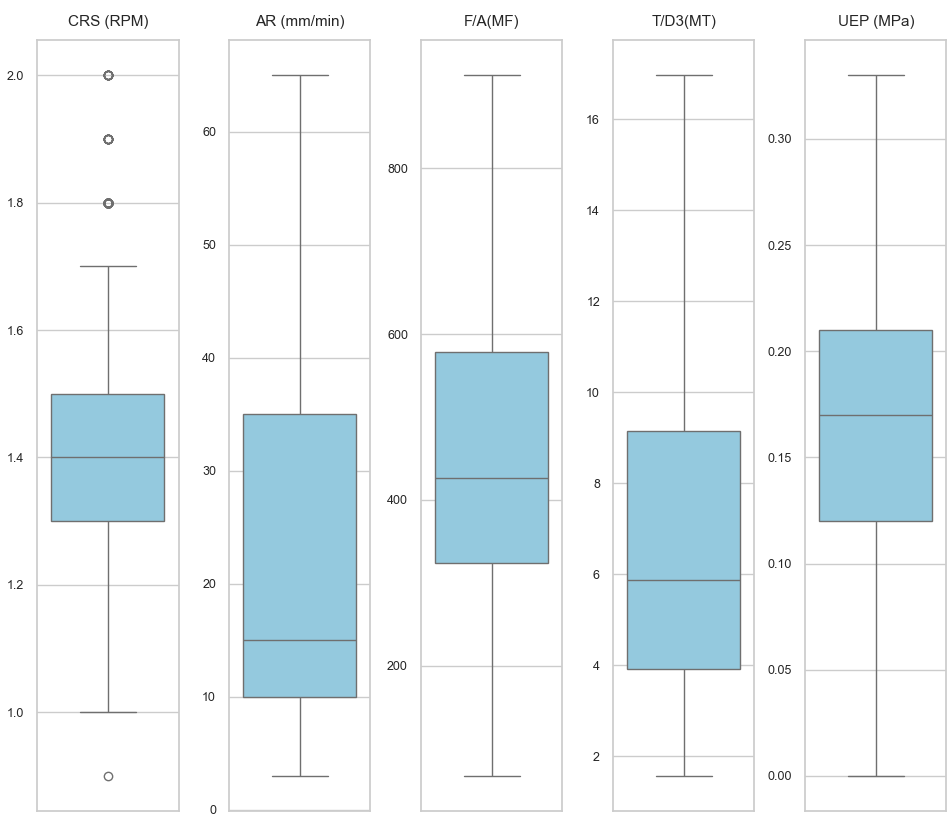
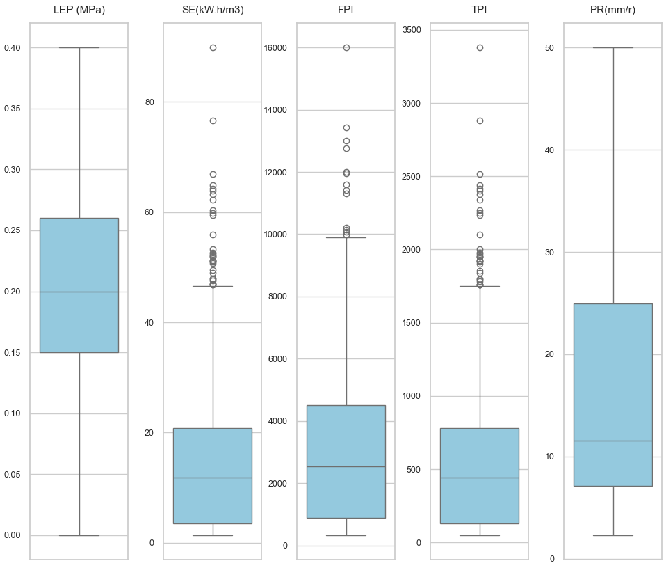
_Figure 1 et 2 : Boîtes à moustaches montrant la dispersion et les valeurs aberrantes de chaque paramètre._

### Légende des boîtes à moustaches

**Légende :**
- La moustache inférieure indique la valeur minimale.
- La moustache supérieure indique la valeur maximale.
- La ligne à l’intérieur de la boîte représente la médiane.
- Le rectangle bleu (boîte) représente l’intervalle interquartile (IQR), qui contient 50 % des données centrales.
- L’étendue (min-max) de chaque variable est affichée sur son axe respectif.

**Résumé des boxplots pour chaque variable :**

**CRS (RPM)**
- La moustache inférieure indique la valeur minimale : 1.1
- La moustache supérieure indique la valeur maximale : 1.5
- La ligne à l’intérieur de la boîte représente la médiane : 1.3
- La boîte bleue représente l’IQR : de 1.2 (Q1) à 1.3 (Q3)
- L’étendue de CRS (RPM) est de 1.1 à 1.5

**AR (mm/min)**
- La moustache inférieure indique la valeur minimale : 7.0
- La moustache supérieure indique la valeur maximale : 51.0
- La ligne à l’intérieur de la boîte représente la médiane : 35.0
- La boîte bleue représente l’IQR : de 30.0 (Q1) à 40.0 (Q3)
- L’étendue de AR (mm/min) est de 7.0 à 51.0

**F/A(MF)**
- La moustache inférieure indique la valeur minimale : 196.17
- La moustache supérieure indique la valeur maximale : 488.14
- La ligne à l’intérieur de la boîte représente la médiane : 288.93
- La boîte bleue représente l’IQR : de 278.28 (Q1) à 349.76 (Q3)
- L’étendue de F/A(MF) est de 196.17 à 488.14

**T/D3(MT)**
- La moustache inférieure indique la valeur minimale : 1.92
- La moustache supérieure indique la valeur maximale : 9.27
- La ligne à l’intérieur de la boîte représente la médiane : 3.30
- La boîte bleue représente l’IQR : de 2.87 (Q1) à 4.31 (Q3)
- L’étendue de T/D3(MT) est de 1.92 à 9.27

**UEP (MPa)**
- La moustache inférieure indique la valeur minimale : 0.03
- La moustache supérieure indique la valeur maximale : 0.19
- La ligne à l’intérieur de la boîte représente la médiane : 0.13
- La boîte bleue représente l’IQR : de 0.12 (Q1) à 0.16 (Q3)
- L’étendue de UEP (MPa) est de 0.03 à 0.19

**LEP (MPa)**
- La moustache inférieure indique la valeur minimale : 0.04
- La moustache supérieure indique la valeur maximale : 0.21
- La ligne à l’intérieur de la boîte représente la médiane : 0.14
- La boîte bleue représente l’IQR : de 0.12 (Q1) à 0.16 (Q3)
- L’étendue de LEP (MPa) est de 0.04 à 0.21

**SE(kW.h/m3)**
- La moustache inférieure indique la valeur minimale : 1.58
- La moustache supérieure indique la valeur maximale : 31.96
- La ligne à l’intérieur de la boîte représente la médiane : 2.76
- La boîte bleue représente l’IQR : de 2.01 (Q1) à 3.24 (Q3)
- L’étendue de SE(kW.h/m3) est de 1.58 à 31.96

**FPI**
- La moustache inférieure indique la valeur minimale : 463.08
- La moustache supérieure indique la valeur maximale : 5142.86
- La ligne à l’intérieur de la boîte représente la médiane : 783.33
- La boîte bleue représente l’IQR : de 605.29 (Q1) à 1248.0 (Q3)
- L’étendue de FPI est de 463.08 à 5142.86

**TPI**
- La moustache inférieure indique la valeur minimale : 56.8
- La moustache supérieure indique la valeur maximale : 1200.0
- La ligne à l’intérieur de la boîte représente la médiane : 92.0
- La boîte bleue représente l’IQR : de 66.44 (Q1) à 197.6 (Q3)
- L’étendue de TPI est de 56.8 à 1200.0

**PR(mm/r)**
- La moustache inférieure indique la valeur minimale : 5.83
- La moustache supérieure indique la valeur maximale : 38.33
- La ligne à l’intérieur de la boîte représente la médiane : 26.92
- La boîte bleue représente l’IQR : de 15.38 (Q1) à 31.82 (Q3)
- L’étendue de PR(mm/r) est de 5.83 à 38.33

Chaque boxplot représente la distribution des valeurs d’une variable donnée. Certaines variables, comme SE (énergie spécifique), FPI et TPI, montrent de nombreux points au-delà des moustaches, indiquant la présence de valeurs extrêmes (outliers). Cela justifie leur traitement pendant le prétraitement. D’autres variables, comme CRS (RPM) ou AR (mm/min), présentent une distribution plus resserrée, ce qui indique une variabilité plus faible. L’analyse des boxplots permet ainsi d’identifier rapidement les variables qui nécessitent une attention particulière pour assurer la robustesse des analyses ultérieures.

Par exemple, les variables SE (énergie spécifique), FPI et TPI présentent de nombreux points au-delà des moustaches, indiquant la présence de valeurs extrêmes (outliers) susceptibles de biaiser les analyses statistiques. Ces variables nécessitent donc un traitement spécifique, comme la suppression ou l’imputation des valeurs aberrantes, afin de garantir la fiabilité des résultats. À l’inverse, des variables telles que CRS (RPM) ou AR (mm/min) présentent une distribution plus homogène et nécessitent moins d’ajustements. Ainsi, l’analyse des boxplots permet de cibler précisément les variables à surveiller et à corriger lors du prétraitement.

## Analyse exploratoire des données

### Histogrammes des variables

Les histogrammes suivants montrent la distribution de chaque variable, en mettant en évidence l’asymétrie et la présence de valeurs extrêmes :
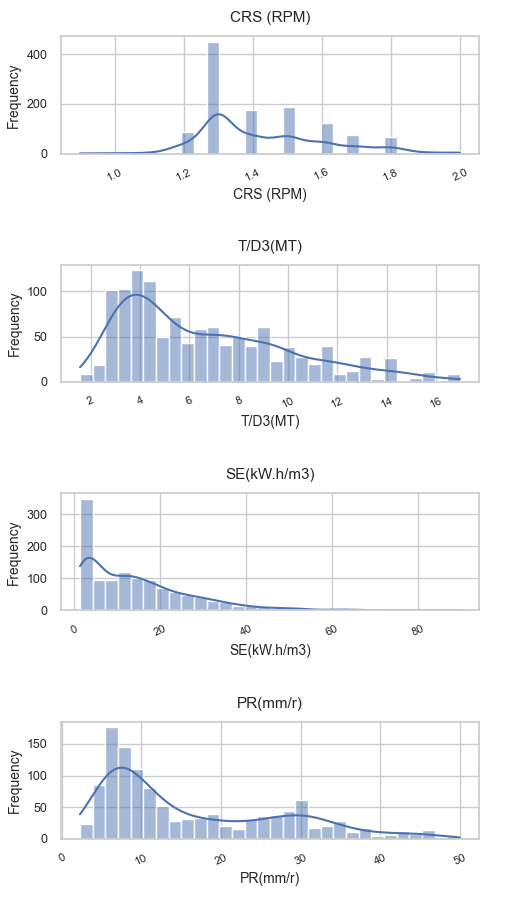
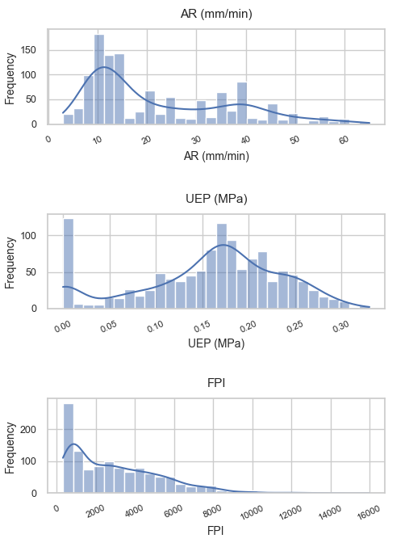
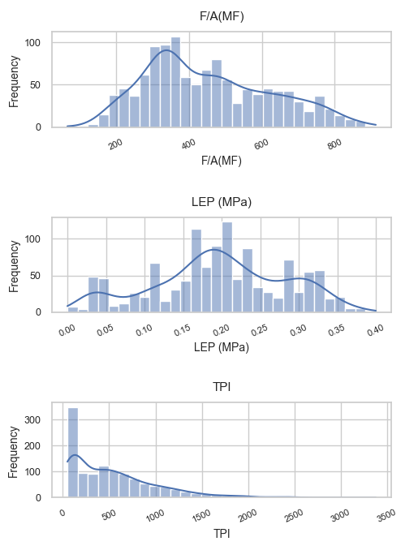

_Figures 3, 4 et 5 : Histogrammes montrant la distribution de chaque paramètre._

Une analyse plus détaillée des histogrammes met en évidence la nature asymétrique des distributions pour la plupart des variables. Cette asymétrie, avec une majorité de faibles valeurs et quelques valeurs extrêmes, suggère que le comportement de la machine est globalement stable, mais que des événements rares et extrêmes peuvent survenir et impacter significativement la performance globale. Par exemple, la longue traîne droite observée pour SE et FPI indique la possibilité de conditions de fonctionnement particulièrement difficiles, à prendre en compte lors de la modélisation prédictive. Cette observation souligne l’importance d’utiliser des méthodes statistiques robustes ou des transformations adaptées pour limiter l’influence des valeurs extrêmes.

## Analyse des histogrammes pour chaque variable :

- **CRS (RPM) :** La distribution de CRS (RPM) est asymétrique à gauche, avec la plupart des valeurs fortement concentrées entre 1.2 et 1.3. La dispersion est très faible, indiquant une faible variabilité de ce paramètre. On observe très peu de valeurs élevées et pas d’outliers marqués, ce qui suggère une vitesse de rotation globalement stable.

- **AR (mm/min) :** La variable AR (mm/min) présente une distribution asymétrique à droite. La majorité des valeurs se situe entre 20 et 40 mm/min, avec une traîne vers les valeurs plus élevées, indiquant des phases occasionnelles d’avancement plus rapide.

- **F/A(MF) :** F/A(MF) est globalement proche d’une distribution symétrique, avec la majorité des points entre 250 et 350. La distribution est relativement équilibrée, avec quelques valeurs extrêmes de part et d’autre, mais sans asymétrie marquée.

- **T/D3(MT) :** La distribution de T/D3(MT) est légèrement asymétrique à droite, avec la plupart des valeurs entre 2 et 4. Quelques valeurs plus élevées forment une traîne droite, potentiellement associée à des conditions opérationnelles rares.

- **UEP (MPa) :** UEP (MPa) est fortement asymétrique à droite, avec la grande majorité des valeurs proches du minimum (environ 0.1 MPa). Quelques valeurs élevées sont observées, ce qui indique que des pics de pression restent rares mais possibles.

- **LEP (MPa) :** LEP (MPa) présente aussi une asymétrie à droite, avec la plupart des valeurs vers 0.1-0.15 MPa et quelques valeurs plus élevées qui allongent la traîne.

- **SE(kW.h/m3) :** SE(kW.h/m3) montre une asymétrie à droite prononcée, avec la majorité des points à faibles valeurs (autour de 2-3) et une longue traîne vers les valeurs élevées. Cela indique un fonctionnement souvent efficace, mais avec des épisodes rares de forte consommation d’énergie spécifique.

- **FPI :** FPI présente une forte asymétrie à droite, avec des valeurs majoritairement concentrées en bas de distribution (autour de 500-800) et plusieurs outliers élevés.

- **TPI :** TPI est asymétrique à droite, avec la majorité des valeurs entre 50 et 200. Quelques valeurs nettement plus élevées créent une longue traîne.

- **PR(mm/r) :** PR(mm/r) est légèrement asymétrique à droite, avec la plupart des valeurs entre 10 et 35. Quelques valeurs élevées prolongent la distribution.

### Nuages de points : PR vs paramètres

Les nuages de points suivants illustrent les relations entre le taux de progression (PR) et les principaux paramètres :
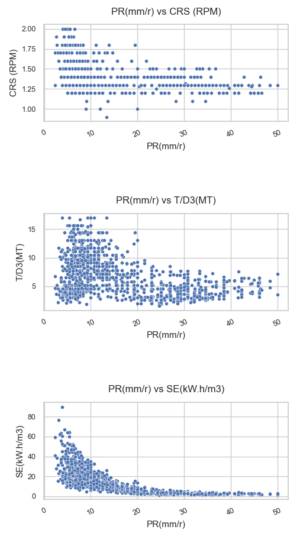
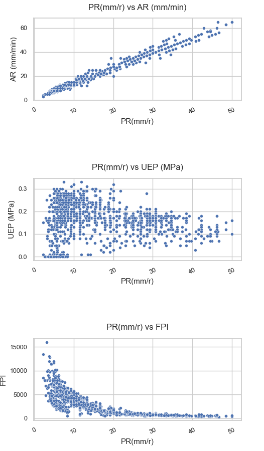
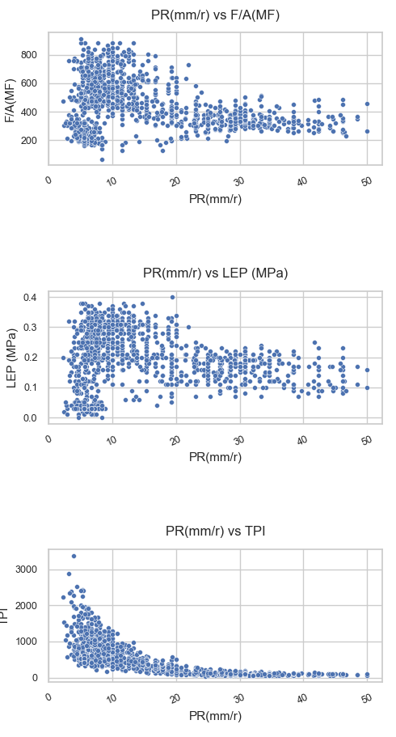

_Figure 4 : Nuages de points montrant la relation entre PR et chaque paramètre._

Un examen approfondi des nuages de points révèle non seulement la force des corrélations, mais aussi la présence de sous-groupes ou de tendances non linéaires. Par exemple, la relation positive entre AR et PR est très marquée, mais on observe aussi une dispersion croissante aux valeurs élevées, ce qui peut traduire l’influence de facteurs supplémentaires. Pour SE, FPI et TPI, la tendance négative est nette, mais certains points s’écartent de la tendance générale, suggérant des cas particuliers ou des conditions opérationnelles atypiques. L’analyse visuelle permet ainsi d’identifier des zones d’intérêt pour des investigations plus fines.

**Analyse détaillée des nuages de points (PR sur l’axe x) :**

- **CRS (RPM) vs PR :** Aucune tendance nette n’est observée (relation faible voire absente). Les points sont largement dispersés selon PR, sans sous-groupes clairement marqués.

- **AR (mm/min) vs PR :** Une relation positive forte et majoritairement linéaire est visible. La plupart des points suivent une tendance claire, avec une dispersion qui augmente aux fortes valeurs de PR.

- **F/A(MF) vs PR :** La relation paraît faible, avec un nuage diffus sans tendance croissante ou décroissante nette.

- **T/D3(MT) vs PR :** Une association faible est observée, possiblement non linéaire. Les points sont dispersés avec quelques observations atypiques.

- **UEP (MPa) vs PR :** Une légère tendance négative est visible : des valeurs élevées de UEP apparaissent plus souvent à faibles valeurs de PR.

- **LEP (MPa) vs PR :** Le schéma est faible et légèrement négatif. La plupart des points sont concentrés à faibles valeurs de LEP tandis que PR varie sur une large plage.

- **SE (kW.h/m3) vs PR :** Une relation négative claire et non linéaire est observée. Les valeurs élevées de SE sont principalement associées à de faibles PR.

- **FPI vs PR :** Une association négative est visible, avec des valeurs élevées de FPI plus fréquentes lorsque PR est faible.

- **TPI vs PR :** Le nuage indique une relation négative : des valeurs élevées de TPI sont généralement liées à des valeurs faibles de PR.

### Cartes de densité : PR vs paramètres

Les cartes de densité apportent un éclairage complémentaire sur la concentration des points et la nature des relations :
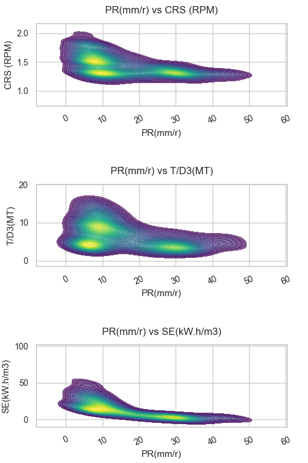
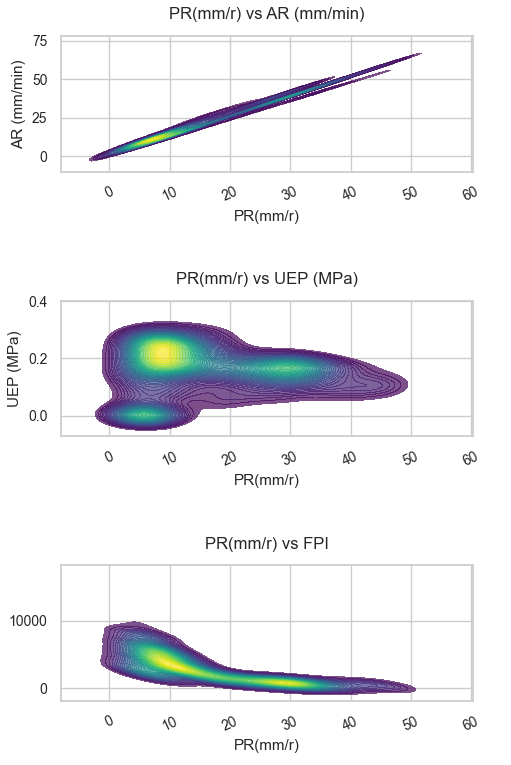
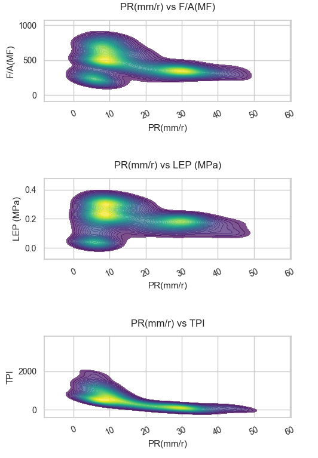

_Figure 5 : Cartes de densité pour PR et chaque paramètre._

Les cartes de densité fournissent une perspective complémentaire en mettant en évidence les zones de forte concentration des données. Pour AR vs PR, la densité maximale dans la zone des valeurs élevées confirme la corrélation positive et suggère que la majorité des observations se situe dans des conditions de performance favorables. À l’inverse, pour SE, FPI et TPI, la densité se concentre dans des zones de faible PR et de valeurs élevées des indices, ce qui indique que les situations difficiles sont moins fréquentes mais fortement associées à une baisse de performance.

**Analyse détaillée des cartes de densité (PR sur l’axe x) :**

- **CRS (RPM) vs PR :** La région de plus forte densité se concentre autour de valeurs de CRS proches de 1.3-1.4, avec PR couvrant une large plage. La tendance globale est modérément négative, sans linéarité stricte.

- **AR (mm/min) vs PR :** La densité est fortement concentrée le long d’une diagonale, indiquant une relation positive forte et majoritairement linéaire.

- **F/A(MF) vs PR :** La densité est relativement étalée, sans crête marquée. Seule une faible tendance (légèrement négative) est visible.

- **T/D3(MT) vs PR :** La zone de densité maximale est centrée sur des valeurs intermédiaires de T/D3(MT), tandis que PR varie fortement. La tendance est faible à modérément négative.

- **UEP (MPa) vs PR :** La densité est principalement concentrée à de très faibles valeurs de UEP, avec PR réparti sur des valeurs faibles à modérées. Aucune tendance claire ne ressort.

- **LEP (MPa) vs PR :** Le pic de densité se situe à faibles valeurs de LEP, avec une large variabilité de PR. La tendance est faible et légèrement négative.

- **SE (kW.h/m3) vs PR :** Une relation négative forte et non linéaire est visible. Les fortes valeurs de SE correspondent majoritairement à de faibles PR.

- **FPI vs PR :** La carte montre une association négative forte : les PR élevées se situent surtout pour des FPI faibles à modérées, alors que les FPI élevées se concentrent à faibles PR.

- **TPI vs PR :** Une tendance négative forte apparaît, avec une densité maximale à faibles TPI et PR plus élevées. Quand TPI augmente, la densité se déplace vers des PR plus faibles.

### Matrice de corrélation (Spearman)

La matrice de corrélation de Spearman ci-dessous synthétise la force et le sens des relations entre toutes les variables :
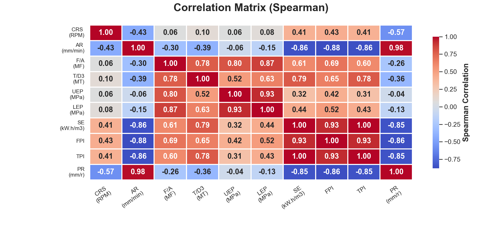
_Figure 6 : Matrice de corrélation de Spearman pour l’ensemble des variables._

Une lecture plus détaillée de la matrice de Spearman met en évidence plusieurs structures importantes, à la fois en corrélations directes (positives) et inverses (négatives). D’abord, la corrélation entre AR et PR est extrêmement forte et positive ($\rho \approx 0.98$), ce qui confirme qu’une hausse de l’avance est associée de manière cohérente à une hausse du taux de pénétration. À l’inverse, les relations entre PR et SE, FPI et TPI sont fortement négatives ($\rho \approx -0.85$ à $-0.86$) : lorsque ces indicateurs de difficulté augmentent, PR tend à diminuer fortement. Il s’agit d’un schéma clair de corrélation inverse.

La matrice permet aussi de distinguer des effets modérés et faibles : CRS présente une association négative modérée avec PR ($\rho \approx -0.57$), tandis que T/D3 et F/A(MF) montrent des corrélations négatives faibles à modérées ($\rho \approx -0.36$ et $-0.26$). UEP et LEP présentent des liens faibles avec PR (proches de 0), ce qui suggère un pouvoir explicatif monotone limité lorsqu’elles sont considérées seules. Par ailleurs, les corrélations très élevées entre certaines variables explicatives (par exemple SE-TPI proche de 1.00 et liens forts FPI-SE/TPI) indiquent une possible redondance et un risque de multicolinéarité. Pour la modélisation, cela suggère de privilégier une sélection de variables ou des méthodes de régularisation, afin d’éviter de surpondérer des variables fortement redondantes et d’améliorer la robustesse ainsi que l’interprétabilité du modèle.

## Interprétation et discussion

Ces résultats confirment l’importance de certains paramètres mécaniques et énergétiques dans le taux de progression du tunnelier. L’avance (AR) apparaît comme le facteur principal, tandis qu’une augmentation de l’énergie spécifique ou des indices de performance traduit une difficulté accrue d’avancement. Les visualisations et l’analyse statistique permettent ainsi de sélectionner les variables les plus pertinentes pour la modélisation prédictive à venir.

## Conclusion

Le prétraitement et l’analyse exploratoire ont permis de fiabiliser le jeu de données et de mieux comprendre la structure des relations entre variables. Ces étapes constituent une base solide pour le développement de modèles de prédiction du taux de progression.
Cependant, la présence de valeurs aberrantes dans le jeu de données nécessite une attention particulière pendant la modélisation. Il sera nécessaire d’évaluer l’impact de ces valeurs extrêmes sur les performances du modèle afin de décider s’il faut les conserver ou non.
